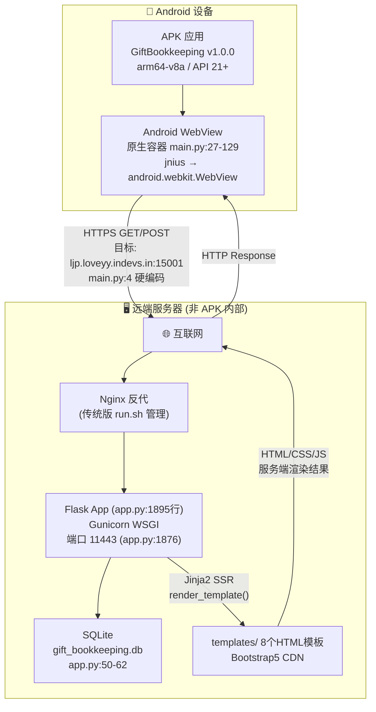
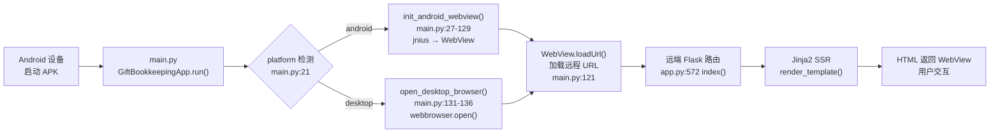
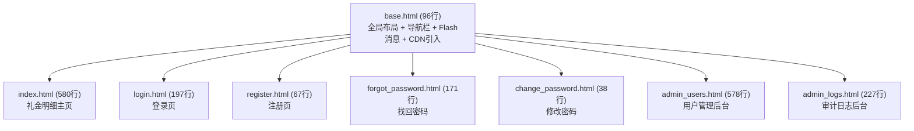
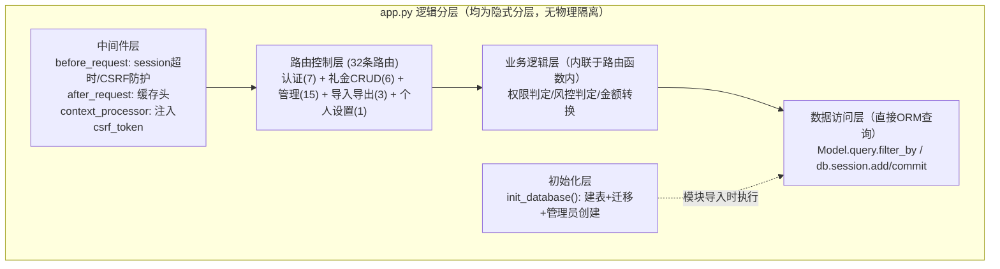
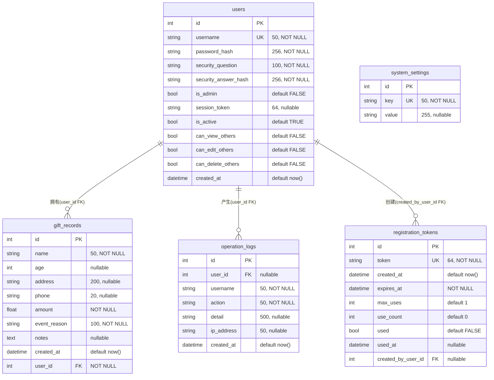
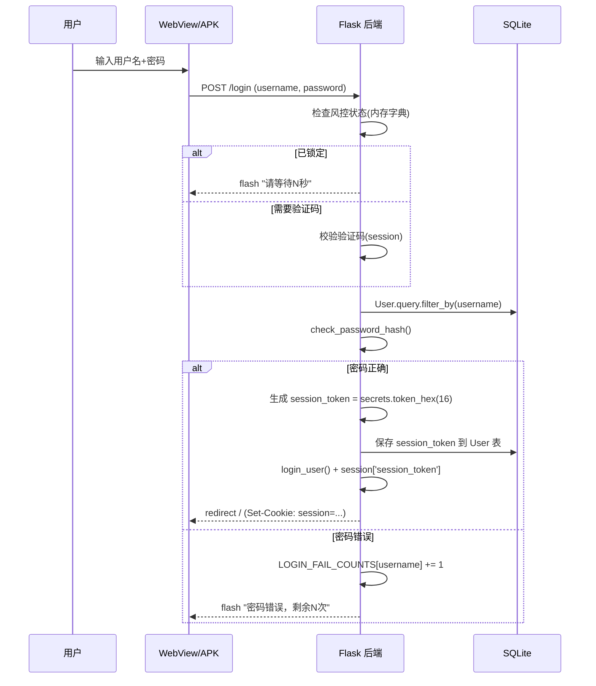
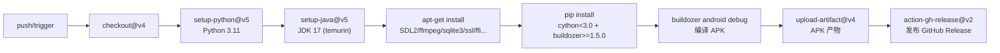
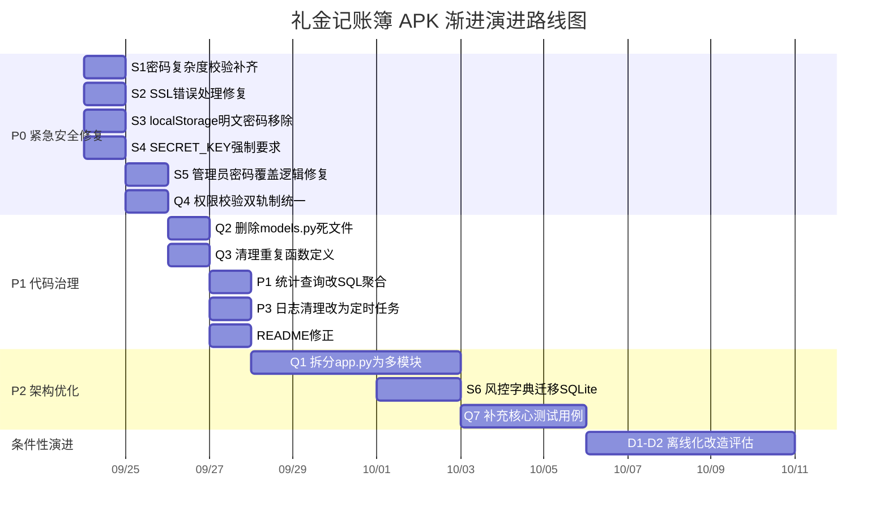
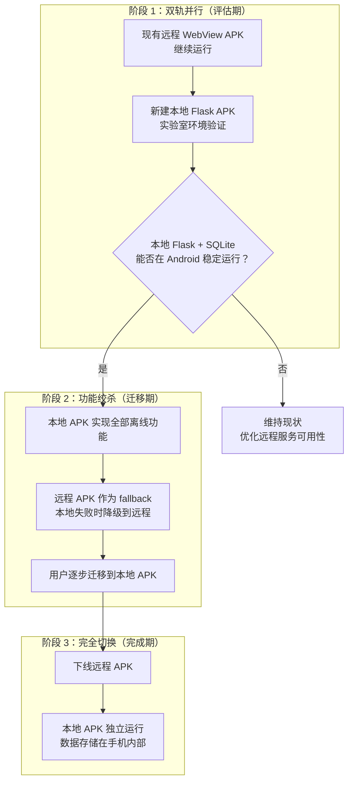

---
AIGC:
  ContentProducer: '001191110102MAD55U9H0F10002'
  ContentPropagator: '001191110102MAD55U9H0F10002'
  Label: '1'
  ProduceID: '3df2222e-f9bb-45ff-8685-c5655ff7d1af'
  PropagateID: '3df2222e-f9bb-45ff-8685-c5655ff7d1af'
  ReservedCode1: '5fc9a976-18e2-4457-91e5-8c50f9ae8bcd'
  ReservedCode2: '5fc9a976-18e2-4457-91e5-8c50f9ae8bcd'
---

# 礼金记账簿 Android APK — PSD 项目系统设计与重构决策文档

> **项目路径**：`gift_bookkeeping_apk/`  
> **文档版本**：V1.0  
> **生成日期**：2026-09-23  
> **审计基准提交**：`0fe2e38`  
> **代码行数**：app.py (1895行) + main.py (144行) + models.py (61行) + 8模板 (1947行)

---

## 目录

1. **项目全局概览** — 业务定位 · 技术栈全景 · 架构拓扑
2. **代码架构逆向推导与漂移矩阵** — README vs 代码 · models.py 死文件 · 姊妹仓库功能对照
3. **架构模式识别** — 单体 + SSR + 远程 WebView 容器
4. **架构耦合度诊断** — 纯业务代码 · 强侵入代码 · 反模式
5. **架构替换与轻量化可行性决策** — 动机评估 · ROI 矩阵 · 模块分级 · 结论
6. **前后端详尽规格（校准整合版）** — 前端架构 · 后端分层 · 中间件 · API 规范
7. **数据持久化设计** — ER 关系 · 字段约束 · 索引 · 事务
8. **工程与安全保障** — 环境变量 · 认证鉴权 · CI/CD · 安全清单
9. **综合问题排查与渐进演进路线图** — 五维技术债 · P0/P1/P2 路线 · 绞杀者模式

---

## 1. 项目全局概览

### 1.1 业务定位

本项目是「人情记账宝」产品矩阵的 Android 端交付形态，定位为**安卓手机/平板上的礼金收付记账工具**。产品矩阵共三个仓库：

- Web 原生部署版（`gift-bookkeeping-app`）— 全功能版，含 Webhook、WebDAV 备份、专属宴席、AI 助手等
- Docker Compose 版（`gift-bookkeeping-app-docker`）— 容器化部署版
- **Android APK 版（`gift_bookkeeping_apk`）— 本仓库**，功能子集，聚焦礼金记录 CRUD + 用户权限 + 导入导出

> **[严重漂移] 核心架构真相揭露**
>
> README 第 14 行声称"用户可以在 Android 手机/平板上脱机离线使用"，但 `main.py:4` 硬编码远程 URL `TARGET_URL = "https://ljp.loveyy.indevs.in:15001/"`。APK 实际上是一个 **加载远程 Web 页面的 Android WebView 容器**，所有业务逻辑运行在远端 Flask 服务器上，设备端无任何本地后端服务或独立数据库。此为项目最重大的文档-实现漂移。

### 1.2 真实技术栈全景清单

| 层面 | 技术/框架 | 版本 | 代码依据 |
|---|---|---|---|
| 后端语言 | Python | 3.11 (CI) | `build_apk.yml:25` |
| Web 框架 | Flask | 3.0.3 | `requirements.txt:1`, `app.py:13` |
| ORM | Flask-SQLAlchemy | 3.1.1 | `requirements.txt:2`, `app.py:15,65` |
| 表单安全 | Flask-WTF (CSRFProtect) | 1.2.1 | `requirements.txt:3`, `app.py:14` |
| 身份认证 | Flask-Login | 0.6.3 | `requirements.txt:4`, `app.py:16,68-72` |
| 密码加密 | Werkzeug (pbkdf2_sha256) | 3.0.3 | `requirements.txt:5`, `app.py:17,92-96` |
| 反向代理适配 | Werkzeug ProxyFix | — | `app.py:18,39` |
| 数据库 | SQLite (嵌入式文件) | — | `app.py:50-62` |
| WSGI | Gunicorn | 22.0.0 | `requirements.txt:6` |
| 加密库 | cryptography | 42.0.8 | `requirements.txt:7` |
| 桌面 WebView | pywebview | >=4.0.0 | `requirements.txt:8`（仅桌面调试用） |
| 前端 UI | Bootstrap 5 + FontAwesome 6 + Bootstrap Icons | CDN | `templates/base.html:7-9` |
| 模板引擎 | Jinja2 (Flask 内置) | — | `app.py:13` |
| 移动端框架 | Kivy + pyjnius | — | `main.py:7-11`, `buildozer.spec:31` |
| Android 打包 | Buildozer (p4a, sdl2 bootstrap) | >=1.5.0 | `buildozer.spec`, `build_apk.yml:63` |
| CI/CD | GitHub Actions | — | `.github/workflows/build_apk.yml` |
| 目标架构 | arm64-v8a (仅 64 位) | API 33 / min 21 | `buildozer.spec:43,46,61` |

> **技术栈分层说明**
>
> 本项目的"技术栈"实际跨越两个独立运行环境：**远端服务端**（Flask + SQLAlchemy + SQLite + Jinja2 SSR，即 `app.py` 全部逻辑）和**设备端**（Kivy + pyjnius + Android WebView，即 `main.py`）。APK 打包仅包含设备端代码（`buildozer.spec:31` 的 requirements 为 `python3,hostpython3,openssl,pyjnius,kivy`），Flask 及其依赖不进入 APK 包。

### 1.3 端到端架构拓扑图



> **[警告] 架构拓扑关键发现**
>
> - **非离线架构**：APK 内无 Flask 服务，所有请求都发往远程服务器。设备无网络时 APK 完全不可用。
> - **WebView SSL 验证被禁用**：`main.py:52-54` `onReceivedSslError` 无条件执行 `handler.proceed()`，存在中间人攻击风险。
> - **WebView 配置宽松**：`main.py:93-94` 启用 `setAllowFileAccess(True)` 和 `setAllowContentAccess(True)`；`main.py:106` 允许第三方 Cookie。
> - **服务端无内置 HTTPS**：`app.py:1876` 默认端口 11443 但 `app.py` 内未配置 SSL 证书，依赖外部 Nginx 或传统版 `run.sh`。

### 1.4 项目仓库 Git 概况

| 指标 | 值 | 说明 |
|---|---|---|
| 分支策略 | 单分支 `main` | 无 develop/feature 分支 |
| 总提交数 | 12 | 从 `a194a85`（初始化）到 `0fe2e38`（最新） |
| 贡献方式 | 单人提交 | 所有提交为同一作者 |
| 文件总数 | git 追踪 16 个文件 | 极小型仓库 |
| 核心代码文件 | 3 个 .py + 8 个 .html | `app.py`(1895行) + `main.py`(144行) + `models.py`(61行，死代码) + 模板(~1947行) |

---

## 2. 代码架构逆向推导与漂移矩阵

本仓库**无独立历史设计文档**（无 PSD / 架构文档 / API 规格文档），仅有 `README.md` 作为使用说明。姊妹仓库 `gift_bookkeeping_app/Project_Survey.md`（1138行，38 条 ADR）描述的是传统 Web 版完整设计，本节将其作为**设计意图参考**进行交叉核验。

### 2.1 漂移矩阵 A — README 声明 vs 代码真实实现

| # | 模块/功能 | README 声明（位置） | 代码真实实现（位置） | 状态 | 影响评估 |
|---|---|---|---|---|---|
| D1 | 离线运行能力 | "用户可以在 Android 手机/平板上**脱机离线**使用"（README:14） | `main.py:4` 硬编码 `TARGET_URL = "https://ljp.loveyy.indevs.in:15001/"`，APK 为远程 WebView 容器，无本地 Flask 服务 | ❌未落地 | **严重**。核心卖点与实现完全矛盾；无网络环境 APK 不可用 |
| D2 | 嵌入式 SQLite 本地存储 | "采用嵌入式 SQLite 数据库，数据安全保存在**手机内部私有存储空间**"（README:37） | `app.py:42-55` 数据库路径逻辑仅在 `sys.frozen`（PyInstaller）时写入 `~/.gift_bookkeeping/`，但 Buildozer/Kivy 不会触发 `sys.frozen`；数据库运行在远端服务器 | ❌未落地 | **严重**。数据实际存储在远端服务器 SQLite 文件中 |
| D3 | 原生全屏 WebView | "原生全屏 WebView 沉浸式交互体验"（README:38） | `main.py:36-37` 仅设置 `MATCH_PARENT`；`buildozer.spec:37` `fullscreen = 0`（非全屏） | ⚠️部分实现 | **轻微** |
| D4 | 完全包含 Web 版所有功能 | "完全包含 Web 版的所有功能"（README:29） | 对比传统版 ADR-01~38，APK 版**缺失**：Webhook、WebDAV、专属宴席、纪念日提醒、AI 助手、权限工单、回收站等 | ❌已废弃 | **中等**。实际为 Web 版功能子集 |
| D5 | 默认访问地址 | `http://127.0.0.1:5000`（README:114） | `app.py:1876` 默认端口 `11443`；`main.py:4` WebView 加载远程地址 | ⚠️不一致 | **轻微** |
| D6 | 项目架构目录树 | README:46-67 列出 `models.py` 标注为"数据库模型" | `models.py` 从未被任何文件 import，为**死代码**。实际模型内联于 `app.py:74-149,312-323` | ❌不一致 | **中等**。误导开发者 |

### 2.2 漂移矩阵 B — models.py 死文件 vs app.py 内联模型

`models.py` 定义了 `User` 和 `GiftRecord` 两个模型，但**全仓库无任何 `import models` 语句**。该文件是一个从未被引用的草稿，其 schema 与 `app.py` 内联模型存在**重大差异**：

#### User 模型差异

| 对比维度 | models.py（死代码） | app.py（实际运行） | 状态 |
|---|---|---|---|
| admin 标识方式 | `role = db.Column(db.String(20), default='user')` + `@property is_admin` (`models.py:15,42-44`) | `is_admin = db.Column(db.Boolean, default=False)` 直接布尔列 (`app.py:81`) | ❌已重构 |
| username 长度 | `String(64)` (`models.py:13`) | `String(50)` (`app.py:77`) | ⚠️不一致 |
| security_question | `String(200), nullable=True` (`models.py:16`) | `String(100), nullable=False` (`app.py:79`) | ⚠️不一致 |
| security_answer_hash | `nullable=True` (`models.py:17`) | `nullable=False` (`app.py:80`) | ⚠️不一致 |
| session_token | **不存在** | `String(64), nullable=True` (`app.py:82`) | ❌缺失 |
| 关系定义 | `# records = db.relationship(...)` 被注释 (`models.py:25`) | `records = db.relationship('GiftRecord', backref='owner', cascade='all, delete-orphan')` (`app.py:90`) | ⚠️不一致 |

#### GiftRecord 模型差异

| 对比维度 | models.py（死代码） | app.py（实际运行） | 状态 |
|---|---|---|---|
| name 长度 | `String(64)` (`models.py:51`) | `String(50)` (`app.py:315`) | ⚠️不一致 |
| address 长度 | `String(256)` (`models.py:53`) | `String(200)` (`app.py:317`) | ⚠️不一致 |
| phone 长度 | `String(30)` (`models.py:54`) | `String(20)` (`app.py:318`) | ⚠️不一致 |
| event_reason 长度 | `String(128)` (`models.py:56`) | `String(100)` (`app.py:320`) | ⚠️不一致 |
| 关系定义 | `user = db.relationship('User', backref=db.backref('gift_records', lazy=True))` (`models.py:61`) | 无显式定义（通过 User.records 的 backref='owner' 反向获取） | ⚠️不一致 |

#### 缺失模型（models.py 中不存在）

| 模型 | app.py 位置 | 说明 |
|---|---|---|
| SystemSetting | `app.py:106-125` | 系统配置键值表（会话超时、风控参数） |
| RegistrationToken | `app.py:127-137` | 注册邀请令牌表 |
| OperationLog | `app.py:139-149` | 审计日志表 |

#### 基础设施差异

| 对比维度 | models.py | app.py | 状态 |
|---|---|---|---|
| db 实例创建 | `db = SQLAlchemy()` 无 app 绑定 (`models.py:6`) | `db = SQLAlchemy(app)` 直接绑定 (`app.py:65`) | ⚠️不一致 |

### 2.3 漂移矩阵 C — 姊妹仓库功能清单 vs APK 实现状态

| 功能模块 | 传统版 ADR/章节 | APK 实现 | 说明 |
|---|---|---|---|
| 礼金收支 CRUD | ADR-06 §6.1 | ✅已实现 | 增删改查 + 批量删除 + 清空 |
| 中文金额转换 | §6.1 | ✅已实现 | `cn2num()` / `num2cn()` `app.py:340-482` |
| 统计面板 | — | ✅已实现 | 总笔数/总额/均值/最大值 `app.py:627-632` |
| 搜索与筛选排序 | — | ✅已实现 | 多字段 ilike + 事由筛选 + 时间/金额排序 `app.py:589-625` |
| CSV 导入导出 | ADR-13 §6.8 | ✅已实现 | 含模板下载 + 智能列映射 `app.py:1695-1865` |
| 用户注册（邀请制） | ADR-14 §6.12 | ✅已实现 | RegistrationToken 令牌验证 `app.py:832-903` |
| 密码找回（密保） | §6.9 | ✅已实现 | 含算术验证码 + 防爆破锁定 `app.py:920-1055` |
| 用户权限 4 级模型 | ADR-11 §6.5 | ✅已实现 | Level 0~3 `app.py:1494-1554` |
| 审计日志 | ADR-08 | ✅已实现 | 自动过期清理（90 天）`app.py:265-310` |
| 注册邀请链接管理 | ADR-14 | ✅已实现 | 生成/删除/批量删除 `app.py:1387-1462` |
| 系统安全参数配置 | §6.9 | ✅已实现 | 超时/锁定/次数可配 `app.py:1281-1312` |
| 专属宴席管理 | ADR-20~22,26 §6.2 | ❌未实现 | 宴席台账、双向归属映射、分享链接等全部缺失 |
| Webhook 通知体系 | ADR-21,24,27~33 | ❌未实现 | 企业微信机器人、多通道推送等全部缺失 |
| WebDAV 备份 | ADR-12,38 | ❌未实现 | 数据级备份/恢复、WAL 快照等全部缺失 |
| 纪念日提醒 | ADR-30~32 | ❌未实现 | 自动巡检推送、自定义提醒等全部缺失 |
| AI 助手 | §8 ADR | ❌未实现 | 自然语言记账、一键测试等全部缺失 |
| 权限工单 | ADR-37 | ❌未实现 | 工单多维度治理缺失 |
| 回收站软删除 | ADR-08 | ❌未实现 | 硬删除模式，无生命周期保留 |
| 敏感数据脱敏 | ADR-36 | ❌未实现 | Webhook 凭证明文存储等（不适用） |

### 2.4 代码内部一致性漂移

| # | 漂移点 | 代码位置 | 说明 | 状态 |
|---|---|---|---|---|
| C1 | 函数重复定义 | `get_max_security_attempts()` 定义于 `app.py:176` 与 `app.py:684`；`get_forgot_security_risk_status()` 定义于 `app.py:184` 与 `app.py:692` | 后定义覆盖前定义，函数体完全一致但表明存在未合并的编辑冲突 | ⚠️代码坏味道 |
| C2 | 权限校验不一致 | `edit_record` (`app.py:1127`) 与 `delete_record` (`app.py:1176`) 使用旧模式 `not is_admin and user_id != current_user.id`；`batch_delete_records` (`app.py:1202`) 使用新函数 `can_user_delete_record()` | 单条编辑/删除未调用统一权限函数，跳过了 `can_edit_others`/`can_delete_others` 权限判定 | ❌功能缺陷 |
| C3 | 密码复杂度校验缺失 | `register` (`app.py:873`) 和 `forgot_password` (`app.py:1034`) 调用 `check_password_complexity()`；但 `change_password` (`app.py:1247`) 和 `admin_reset_user_pass` (`app.py:1621`) **未调用** | 用户可通过修改密码或管理员重置密码设置任意弱口令 | ❌安全漏洞 |
| C4 | __main__ 重复管理员初始化 | `init_database()` (`app.py:538-563`) 已含管理员创建/同步逻辑；`__main__` 块 (`app.py:1882-1893`) 再次独立实现一套管理员初始化逻辑 | 两处逻辑不一致：`init_database()` 创建管理员时完整设置了 security_question 和 security_answer（`app.py:547,552`）；`__main__` 块创建管理员时两者均未设置（security_question 为 NOT NULL 约束，会导致数据库插入错误） | ⚠️代码坏味道 |

---

## 3. 架构模式识别

### 3.1 模式判定结论

> **单体 Flask + 服务端渲染 (SSR) + 远程 WebView 容器**
>
> Monolithic Flask SSR + Remote WebView Container Pattern

### 3.2 入口链路分析



**关键判定依据**：

- **设备端入口**：`main.py:139-141` — Kivy `App.run()` 作为进程入口，最终创建一个 Android `WebView` 控件加载远程 URL
- **服务端入口**：`app.py:1869-1895` — `if __name__ == '__main__'` 块调用 `app.run(host='0.0.0.0', port=11443)`，或通过 Gunicorn 在远端服务器独立启动
- **模块级副作用**：`app.py:566-569` — `init_database()` 在模块导入时立即执行，任何 `import app` 都会触发数据库初始化

### 3.3 路由装配方式

全部 32 条路由通过 `@app.route()` 装饰器直接注册在全局 `app` 实例上，无蓝图 (Blueprint) 分区：

| 类别 | 路由 | 数量 | 代码位置 |
|---|---|---|---|
| 认证 | `/login`, `/login/check_risk`, `/login/captcha`, `/logout`, `/register`, `/forgot-password`, `/forgot-password/captcha` | 7 | `app.py:726-1074` |
| 礼金 CRUD | `/`, `/record/add`, `/record/edit/<id>`, `/record/delete/<id>`, `/records/batch_delete`, `/records/delete_all` | 6 | `app.py:572-1229` |
| 个人设置 | `/change-password` | 1 | `app.py:1231-1254` |
| 用户管理 | `/admin/users`, `/admin/user/permissions/<id>`, `/admin/user/reset_security/<id>`, `/admin/user/toggle_status/<id>`, `/admin/user/reset_pass/<id>`, `/admin/user/delete/<id>`, `/admin/users/batch_delete` | 7 | `app.py:1256-1690` |
| 邀请链接 | `/admin/generate_invite_link`, `/admin/invite_link/delete/<id>`, `/admin/invite_link/batch_delete` | 3 | `app.py:1387-1462` |
| 审计日志 | `/admin/logs`, `/admin/logs/batch_delete`, `/admin/log/delete/<id>`, `/admin/logs/clear` | 4 | `app.py:1313-1492` |
| 系统配置 | `/admin/settings/timeout` | 1 | `app.py:1281-1312` |
| 数据交换 | `/export/csv`, `/import/template`, `/import/csv` | 3 | `app.py:1695-1865` |
| **合计** | | **32** | — |

### 3.4 ORM 使用模式

- **模式**：Flask-SQLAlchemy 活动记录 (Active Record) 风格，模型类直接挂载查询方法 `GiftRecord.query.filter_by(...)`
- **db 实例**：`app.py:65` — `db = SQLAlchemy(app)`，直接绑定 app，无 `db.init_app(app)` 延迟初始化模式
- **迁移策略**：`app.py:488-528` — `init_database()` 中通过 `ALTER TABLE ... ADD COLUMN` 原生 SQL 手动迁移（每个字段一个 try-except），无 Flask-Migrate / Alembic 版本管理
- **查询风格**：全部在路由函数内直接编写查询逻辑，无 Repository 层或 Service 层抽象

### 3.5 通信模式

| 维度 | 实现方式 | 代码依据 |
|---|---|---|
| 客户端-服务端 | HTTP 表单 POST + GET 查询参数（全同步请求，无 AJAX/Fetch） | 全部路由 `request.form.get()` / `request.args.get()`，仅 3 个接口返回 JSON（2 个验证码接口 + 1 个风控状态查询） |
| 会话管理 | Flask Session（服务端签名 Cookie）+ Flask-Login | `app.py:68-72` LoginManager，`app.py:325-338` session_token 双重校验 |
| 前端交互 | Bootstrap 5 模态框 + 表单提交 + 内联 JS | `templates/index.html` 全为 POST 表单 → redirect 模式，无 SPA 路由 |

---

## 4. 架构耦合度诊断

### 4.1 纯业务代码（框架无关，可直接复用）

| 函数/模块 | 代码位置 | 功能 | 复用代价 |
|---|---|---|---|
| `cn2num(s)` | `app.py:340-377` | 中文大写金额转数字（"伍佰元正" → 500.0） | L1 零成本 |
| `num2cn(num)` | `app.py:432-482` | 数字转中文大写金额（500 → "伍佰元整"） | L1 零成本 |
| `check_password_complexity(pwd)` | `app.py:200-206` | 密码复杂度校验（min 6 位 + 字母 + 数字） | L1 零成本 |
| `is_record_owner_admin(record)` | `app.py:380-389` | 判断记录创建者是否为管理员 | L2 微改 |

### 4.2 半业务代码（弱框架依赖，小改可复用）

| 函数/模块 | 代码位置 | 框架依赖点 | 复用代价 |
|---|---|---|---|
| `can_user_view_record(user, record)` | `app.py:392-400` | 仅依赖 `user.is_authenticated` / `user.is_admin` 协议 | L1 零成本 |
| `can_user_edit_record(user, record)` | `app.py:403-415` | 同上 + 调用 `is_record_owner_admin()` | L1 零成本 |
| `can_user_delete_record(user, record)` | `app.py:418-430` | 同上 | L1 零成本 |
| 模型类 `User` 等 | `app.py:74-149` | 继承 `db.Model` / `UserMixin`，绑定 Flask-SQLAlchemy | L2 小改 |

### 4.3 强侵入代码（深度耦合 Flask，替换必须重写）

| 函数/模块 | 代码位置 | 框架依赖深度 | 复用代价 |
|---|---|---|---|
| 全部 32 条路由处理函数 | `app.py:572-1865` | 每条路由直接使用 `request.form` / `session` / `current_user` / `db.session` / `render_template` / `flash` / `redirect` / `url_for` | L3 重写 |
| `check_session_timeout()` | `app.py:209-231` | `@app.before_request` + `current_user` + `session` + `db.session` + `logout_user` | L3 重写 |
| `csrf_protect()` | `app.py:240-248` | `@app.before_request` + `session` + `request` + `abort` | L3 重写 |
| `log_action()` | `app.py:281-310` | `current_user` + `request` + `db.session` + `current_app`（4 重 Flask 上下文依赖） | L3 重写 |
| `init_database()` | `app.py:488-563` | `db.engine` + `db.text` 原生 SQL + ORM 查询 + 全局风控字典 | L3 重写 |
| `index()` 主页路由 | `app.py:572-674` | 单函数 103 行，混杂查询构建/搜索/排序/统计/分页/审计日志/模板渲染 7 种职责 | L4 推倒 |
| `forgot_password()` | `app.py:920-1055` | 单函数 136 行，混杂用户查找/风控锁定/验证码/密保校验/密码复杂度/密码重置 6 种职责 | L4 推倒 |

### 4.4 分层退化坏味道（反模式代码片段）

#### 坏味道 1：胖 Controller — app.py 1895 行单体文件

整个应用（模型 + 路由 + 中间件 + 业务逻辑 + 工具函数 + 数据库初始化）全部堆叠在 `app.py` 一个文件中，无任何分层抽象。

#### 坏味道 2：全量加载统计 — 性能反模式

```python
# app.py:627-632 — 统计计算
all_filtered_records = query.all()          # ⚠ 全量加载到内存
total_count = len(all_filtered_records)
total_amount = sum(r.amount for r in all_filtered_records)
avg_amount = round(total_amount / total_count, 2) if total_count > 0 else 0.0
max_amount = max((r.amount for r in all_filtered_records), default=0.0)
```

> 正确做法是使用 SQL 聚合函数（`db.func.count()` / `db.func.sum()` / `db.func.avg()` / `db.func.max()`），让数据库引擎完成计算。

#### 坏味道 3：权限校验双轨制 — 安全漏洞

```python
# app.py:1127 — edit_record 使用旧模式（跳过 can_edit_others 权限）
if not current_user.is_admin and record.user_id != current_user.id:
    flash('您没有权限修改此记录！', 'danger')
    return redirect(url_for('index'))

# app.py:1202 — batch_delete_records 使用新函数（正确调用权限判定）
if record and can_user_delete_record(current_user, record):
    db.session.delete(record)
```

> **后果**：管理员通过 `/admin/user/permissions` 为普通用户设置了 Level 2/3 权限后，该用户在**批量删除**时可以操作他人记录，但在**单条编辑**时却被拒绝。权限模型出现自相矛盾。

#### 坏味道 4：密码复杂度校验遗漏 — 安全漏洞

```python
# app.py:873 — register：✅ 校验密码复杂度
if len(password) < 6 or not re.search(r'[a-zA-Z]', password) or not re.search(r'\d', password):
    flash('密码强度不足！...', 'danger')

# app.py:1034 — forgot_password：✅ 校验密码复杂度
is_valid, msg = check_password_complexity(new_password)

# app.py:1247 — change_password：❌ 未校验！直接设置新密码
current_user.set_password(new_password)

# app.py:1621 — admin_reset_user_pass：❌ 未校验！管理员可设置任意弱密码
user.set_password(new_password)
```

#### 坏味道 5：内存级风控 — 多进程失效

```python
# app.py:677-682 — 进程内存字典（非持久化、非跨进程共享）
LOGIN_FAIL_COUNTS = {}      # {username: fail_count}
LOGIN_LOCK_UNTILS = {}      # {username: lock_until_timestamp}
FORGOT_SECURITY_FAIL_COUNTS = {}
FORGOT_SECURITY_LOCK_UNTILS = {}
```

> Gunicorn 多 Worker 模式下，每个 Worker 维护独立风控字典，实际允许尝试次数 = `max_login_attempts × worker_count`。进程重启后所有风控状态归零。

#### 坏味道 6：模块级副作用 — 导入即执行

```python
# app.py:566-569 — 模块导入时自动执行数据库初始化
try:
    init_database()
except Exception as _e:
    print(f"[Warning] 应用启动自动初始化数据库提示: {_e}")
```

#### 坏味道 7：死文件 models.py

`models.py`（61 行）从未被任何文件 `import`，其 schema 与 `app.py` 内联模型存在 10+ 处差异。

---

## 5. 架构替换与轻量化可行性决策

### 5.1 替换动机评估

> **结论：APK 不包含 Flask**
>
> `buildozer.spec:31` 的打包依赖为 `python3,hostpython3,openssl,pyjnius,kivy`，**不包含** Flask、Flask-SQLAlchemy 等服务端依赖。APK 仅打包 `main.py`（Kivy WebView 启动器）+ `templates/`（HTML 资源）。Flask 后端运行在远端服务器。

| 动机维度 | 当前状态 | 是否有真实瓶颈 | 评估 |
|---|---|---|---|
| APK 体积过大？ | APK 仅含 Kivy+pyjnius 运行时 + WebView 壳 | ✅否 | 无需为减小 APK 体积而替换 Flask |
| Flask 性能不足？ | 单机 SQLite + SSR，面向个人/家庭场景 | ✅否 | Flask 同步模型在此量级完全胜任 |
| 维护困难？ | app.py 1895 行单体文件、无分层、死文件、安全漏洞 | ⚠️是（但与框架无关） | 问题在于代码组织而非框架选择 |
| 安全风险？ | SSL 验证禁用、密码校验遗漏、内存风控、权限双轨制 | ❌是 | 安全问题可通过补丁修复，不需要框架级替换 |
| 离线能力缺失？ | APK 依赖远程 URL，无法离线使用 | ❌是 | **这是架构模式问题而非框架问题** |

### 5.2 替换代价 vs 收益矩阵

| 方案 | 代价 | 收益 | ROI |
|---|---|---|---|
| **维持现状 + 局部治理** | 低。修复安全漏洞（~2天）、删除死文件（~10分钟）、补充密码校验（~1小时）、拆分 app.py（~3天） | 中。消除安全风险、提升可维护性 | **高 ROI** |
| **Flask → 轻量框架 (FastAPI)** | 高。32 条路由全部重写、Jinja2 模板适配、认证体系重构 | 低。FastAPI 对 SSR 场景无优势；APK 不含 Flask | **低 ROI** |
| **远程 WebView → 本地内嵌 Flask** | 极高。需将 Flask+SQLite 全部打包进 APK | 高。实现真正的离线能力 | **条件性** |
| **WebView 容器 → 纯原生 Android** | 极高。Kotlin/Compose 全重写 | 高。更好的用户体验、性能 | **低 ROI（单人项目不现实）** |

### 5.3 模块可替换性资产分级表

| 级别 | 定义 | 具体模块 | 迁移工作量 |
|---|---|---|---|
| L1 | 纯业务逻辑，零框架依赖 | `cn2num()`, `num2cn()`, `check_password_complexity()`, `can_user_view/edit/delete_record()` | < 1 小时 |
| L2 | 弱框架依赖，小改可复用 | 5 个 ORM 模型类、`is_record_owner_admin()` | 1-2 天 |
| L3 | 强框架侵入，替换需重写 | 32 条路由、3 个中间件钩子、`log_action()`, `init_database()` | 1-2 周 |
| L4 | 架构级推倒重建 | 远程 WebView 容器模式、单体 app.py 文件结构、SSR 模板体系 | 4-8 周 |

### 5.4 明确结论

> **【不建议替换框架，仅局部治理】**

**理由**：

1. **框架不是瓶颈** — APK 不打包 Flask，服务端 Flask 在当前用户量级下性能充分。
2. **核心问题是代码组织与安全漏洞** — 胖 Controller、权限双轨制、密码校验遗漏、死文件等问题与框架选择无关。
3. **离线化改造是唯一值得考虑的架构级演进** — 但这不是"换框架"，而是"变更部署模式"，代价极高，建议作为**条件性演进**保留。

---

## 6. 前后端详尽规格（校准整合版）

### 6.1 前端架构

#### 6.1.1 模板继承体系



#### 6.1.2 base.html 全局布局规格

| 区块 | 实现 | 代码位置 |
|---|---|---|
| CDN 依赖 | Bootstrap 5.3.0 CSS + FontAwesome 6.4.0 + Bootstrap Icons 1.11.3 + Bootstrap 5.3.0 JS Bundle | `base.html:7-9,93` |
| 导航栏 | 固定顶部（`sticky-top`），深色背景；已认证用户显示「礼金账本」+ 管理员可见「用户管理」「审计日志」+ 用户下拉菜单 | `base.html:29-72` |
| Flash 消息 | `get_flashed_messages(with_categories=true)` 渲染为 Bootstrap Alert，支持 success/danger/warning/info 四类 | `base.html:76-85` |
| 内容区 | `` 各页面填充；移动端自适应 | `base.html:75,87` |
| 扩展点 | `` / `` | `base.html:26,94` |
| 页脚 | "© 2026 人情礼金记账系统 - Web预览版" | `base.html:90-92` |

#### 6.1.3 前端交互模式

纯服务端渲染 (SSR) + 少量内联 JS，无前端框架、无前端路由、无状态管理库。

| 交互场景 | 实现方式 | JS 函数（位置） |
|---|---|---|
| 表单提交（增删改） | HTML `<form method="POST">` 同步提交，服务端 redirect 回主页 | 无 JS 介入 |
| 搜索/筛选/排序 | GET 表单 + `onchange="this.form.submit()"` 自动提交 | `index.html` 内联 |
| 分页 | GET 链接 `<a href="?page=N">` | — |
| 每页条数切换 | JS 修改 URL 参数并跳转 | `index.html:504-509` `changePerPage()` |
| 批量删除 | JS 动态构建 `<form>` 并提交 CSRF token | `index.html:496-502` `submitBatchDelete()` |
| 单条删除 | JS `confirm()` 确认后动态构建 `<form>` 提交 | `index.html:511-524` `deleteSingleRecord()` |
| 编辑记录 | Bootstrap Modal + `show.bs.modal` 事件填充表单字段 | `index.html:539-577` |
| 自定义事由切换 | `onchange` 联动显隐自定义输入框 | `index.html:526-537` `toggleCustomReason()` |
| 登录风控状态 | `fetch()` 异步请求 `/login/check_risk` 动态显示验证码/锁定倒计时 | `login.html:103-152` `checkUserRisk()` |
| 登录验证码刷新 | `fetch()` 异步请求 `/login/captcha` | `login.html:60-86` `refreshCaptcha()` |
| 找回密码验证码 | `fetch()` 请求 `/forgot-password/captcha` | `forgot_password.html:118-134` |
| 记住密码（localStorage） | 登录时将用户名+密码存入 `localStorage` | `login.html:186-194` |

> **[严重] 前端安全漏洞：localStorage 存储明文密码**
>
> `login.html:188-189` 在"记住登录"勾选时将**明文密码**存入 `localStorage`（`localStorage.setItem("remember_password", passwordInput.value)`）。任何 XSS 攻击或同域脚本均可直接读取。

### 6.2 后端核心服务分层标准

当前项目**无显式分层**，全部代码位于 `app.py` 单文件。逻辑分层逆向推导：



### 6.3 中间件流水线

| 序 | 钩子 | 类型 | 职责 | 代码位置 |
|---|---|---|---|---|
| 1 | `check_session_timeout()` | `@app.before_request` | 已认证用户超过可配超时时间未操作则强制登出 | `app.py:209-231` |
| 2 | `csrf_protect()` | `@app.before_request` | 对 POST/PUT/PATCH/DELETE 校验 CSRF Token | `app.py:240-248` |
| 3 | 路由处理函数 | `@app.route` | 业务逻辑执行 | `app.py:572-1865` |
| 4 | `add_header()` | `@app.after_request` | 强制无缓存 | `app.py:233-238` |
| 5 | `handle_403()` | `@app.errorhandler(403)` | CSRF 失败时 flash + redirect 登录页 | `app.py:250-253` |
| 6 | `inject_globals()` | `@app.context_processor` | 向所有模板注入 csrf_token / 权限函数 | `app.py:255-263` |

> **CSRF 防护双轨制说明**
>
> `requirements.txt:3` 引入了 `Flask-WTF==1.2.1`，`app.py:14` 也 `from flask_wtf.csrf import CSRFProtect`，但**从未实例化**（无 `CSRFProtect(app)` 调用）。实际 CSRF 防护由 `app.py:240-248` 手写实现。

### 6.4 后台异步任务

> **无异步任务系统**。以下为代码中涉及延迟执行的机制：

| 机制 | 实现方式 | 代码位置 | 问题 |
|---|---|---|---|
| 日志自动清理 | 在 `log_action()` 每次写日志时同步调用 `purge_expired_logs(days=90)` | `app.py:265-279,283` | 每次写日志触发 DELETE 查询，增加请求延迟 |
| 风控状态重置 | 在 `init_database()` 中清空所有内存风控字典 | `app.py:531-537` | 仅在应用启动时执行一次 |
| 会话超时检查 | 在 `before_request` 钩子中同步检查 | `app.py:209-231` | 仅在用户有新请求时触发 |

### 6.5 核心 API 规范清单（核心 10 个接口）

| # | 路径 | 方法 | 鉴权 | CSRF | 权限 | 核心校验规则 | 错误处理 |
|---|---|---|---|---|---|---|---|
| 1 | `/login` | GET/POST | 无 | 是 | — | 用户名+密码+验证码(可选)；失败次数>=max触发锁定+验证码 | flash + redirect |
| 2 | `/login/check_risk` | GET | 无 | 否 | — | 参数 username；返回 JSON: `{fail_count, is_locked, lock_wait, require_captcha}` | JSON 200 |
| 3 | `/register?token=<token>` | GET/POST | 无 | 是 | 邀请令牌 | 令牌有效性；用户名正则 `^[a-zA-Z0-9_\u4e00-\u9fa5]{2,20}$`；密码 min6+字母+数字 | flash + redirect |
| 4 | `/forgot-password` | GET/POST | 无 | 是 | — | 两步流程：find_user → answer_question；密保错误计数；密码复杂度校验 ✅ | flash + redirect |
| 5 | `/` (index) | GET | 登录 | 否 | 管理员/本人 | 搜索 ilike 7字段+中文金额；排序 created_at/amount；分页 5/10/20/50/100；统计⚠全量query.all() | render_template |
| 6 | `/record/add` | POST | 登录 | 是 | 本人 | 必填 name/amount/event_reason；金额支持中文大写 cn2num() | flash + redirect |
| 7 | `/record/edit/<id>` | POST | 登录 | 是 | 管理员/本人 | **[C2缺陷]** 使用旧权限逻辑，跳过 can_edit_others 判定 | flash + redirect |
| 8 | `/record/delete/<id>` | POST | 登录 | 是 | 管理员/本人 | **[C2缺陷]** 同上，批量删除则正确调用 can_user_delete_record() | flash + redirect |
| 9 | `/admin/user/permissions/<id>` | POST | 登录 | 是 | 管理员 | perm_level 0~3 向下包含层级；禁止修改自身权限 | flash + redirect |
| 10 | `/import/csv` | POST | 登录 | 是 | 登录 | .csv 文件；多编码探测；智能列头映射；无事务回滚 | flash + redirect |

#### 全量路由清单（32 条）

| # | 路径 | 方法 | 行号 | 功能 |
|---|---|---|---|---|
| 1 | `/` | GET | 572 | 礼金明细主页 |
| 2 | `/login` | GET/POST | 753 | 用户登录 |
| 3 | `/login/check_risk` | GET | 726 | 查询登录风控状态（JSON） |
| 4 | `/login/captcha` | GET | 738 | 获取登录算术验证码（JSON） |
| 5 | `/logout` | GET | 1057 | 退出登录 |
| 6 | `/register` | GET/POST | 832 | 用户注册（邀请令牌） |
| 7 | `/forgot-password` | GET/POST | 920 | 找回密码 |
| 8 | `/forgot-password/captcha` | GET | 905 | 获取找回密码验证码（JSON） |
| 9 | `/record/add` | POST | 1076 | 新增礼金记录 |
| 10 | `/record/edit/<id>` | POST | 1122 | 编辑礼金记录 |
| 11 | `/record/delete/<id>` | POST | 1168 | 删除单条记录 |
| 12 | `/records/batch_delete` | POST | 1187 | 批量删除记录 |
| 13 | `/records/delete_all` | POST | 1211 | 清空所有记录 |
| 14 | `/change-password` | GET/POST | 1231 | 修改密码 |
| 15 | `/admin/users` | GET | 1256 | 用户管理页面 |
| 16 | `/admin/settings/timeout` | POST | 1281 | 更新系统安全参数 |
| 17 | `/admin/logs` | GET | 1313 | 审计日志页 |
| 18 | `/admin/logs/batch_delete` | POST | 1363 | 批量删除日志 |
| 19 | `/admin/generate_invite_link` | POST | 1387 | 生成注册邀请链接 |
| 20 | `/admin/invite_link/delete/<id>` | POST | 1421 | 删除邀请链接 |
| 21 | `/admin/invite_link/batch_delete` | POST | 1437 | 批量删除邀请链接 |
| 22 | `/admin/log/delete/<id>` | POST | 1464 | 删除单条日志 |
| 23 | `/admin/logs/clear` | POST | 1480 | 清空所有日志 |
| 24 | `/admin/user/permissions/<id>` | POST | 1494 | 修改用户数据权限 |
| 25 | `/admin/user/reset_security/<id>` | POST | 1557 | 重置用户密保问题 |
| 26 | `/admin/user/toggle_status/<id>` | POST | 1582 | 启停用户账号 |
| 27 | `/admin/user/reset_pass/<id>` | POST | 1611 | 重置用户密码 |
| 28 | `/admin/user/delete/<id>` | POST | 1633 | 删除用户 |
| 29 | `/admin/users/batch_delete` | POST | 1652 | 批量删除用户 |
| 30 | `/export/csv` | GET | 1695 | 导出 CSV |
| 31 | `/import/template` | GET | 1728 | 下载导入模板 |
| 32 | `/import/csv` | POST | 1744 | 批量导入 CSV |

---

## 7. 数据持久化设计

### 7.1 核心实体关系图（ER）



### 7.2 字段约束规格

#### users 表

| 字段 | 类型 | 约束 | 业务含义 | 代码位置 |
|---|---|---|---|---|
| `id` | Integer | PK, 自增 | 用户唯一标识 | `app.py:76` |
| `username` | String(50) | UNIQUE, NOT NULL | 用户名（2-20位） | `app.py:77` |
| `password_hash` | String(256) | NOT NULL | Werkzeug pbkdf2_sha256 哈希 | `app.py:78` |
| `security_question` | String(100) | NOT NULL | 密保问题 | `app.py:79` |
| `security_answer_hash` | String(256) | NOT NULL | 密保答案哈希（存储前 `.strip().lower()`） | `app.py:80,98-100` |
| `is_admin` | Boolean | default False | 管理员标识 | `app.py:81` |
| `session_token` | String(64) | nullable | 登录会话令牌（`secrets.token_hex(16)`） | `app.py:82` |
| `is_active` | Boolean | default True, NOT NULL | 账号激活状态 | `app.py:83` |
| `can_view_others` | Boolean | default False, NOT NULL | Level >= 1：查看他人 | `app.py:84` |
| `can_edit_others` | Boolean | default False, NOT NULL | Level >= 2：编辑他人 | `app.py:85` |
| `can_delete_others` | Boolean | default False, NOT NULL | Level 3：删除他人 | `app.py:86` |
| `created_at` | DateTime | default `datetime.now` | 注册时间 | `app.py:87` |

> **[警告] 索引缺失**
>
> `username` 列有 `unique=True`（自动唯一索引），但 `user_id`（`gift_records` / `operation_logs`）外键列**无显式索引**。数据量增长时按 `user_id` 过滤的查询将全表扫描。

#### gift_records 表

| 字段 | 类型 | 约束 | 业务含义 | 代码位置 |
|---|---|---|---|---|
| `id` | Integer | PK | 记录唯一标识 | `app.py:314` |
| `name` | String(50) | NOT NULL | 送礼人姓名 | `app.py:315` |
| `age` | Integer | nullable | 年龄 | `app.py:316` |
| `address` | String(200) | nullable | 联系地址 | `app.py:317` |
| `phone` | String(20) | nullable | 联系电话 | `app.py:318` |
| `amount` | Float | NOT NULL | 礼金金额（元） | `app.py:319` |
| `event_reason` | String(100) | NOT NULL | 办席事由 | `app.py:320` |
| `notes` | Text | nullable | 备注说明 | `app.py:321` |
| `created_at` | DateTime | default `datetime.now` | 登记时间 | `app.py:322` |
| `user_id` | Integer | FK -> users.id, NOT NULL | 录入用户 | `app.py:323` |

#### system_settings 表

| 字段 | 类型 | 约束 | 业务含义 |
|---|---|---|---|
| `id` | Integer | PK | 配置项 ID |
| `key` | String(50) | UNIQUE, NOT NULL | 配置键 |
| `value` | String(255) | nullable | 配置值（字符串，读取时 `int()` 转换） |

**当前已使用的配置键**（`app.py:152-182`）：

- `session_timeout_minutes` — 会话超时分钟数（默认 60，范围 1-10080）
- `max_login_attempts` — 密码最大错误次数（默认 5，范围 1-20）
- `login_lockout_seconds` — 锁定等待秒数（默认 60，范围 0-86400）
- `max_security_attempts` — 密保最大错误次数（默认 3，范围 1-20）

### 7.3 事务机制

| 事务模式 | 实现 | 代码位置 | 问题 |
|---|---|---|---|
| 单操作自动提交 | `db.session.add()` + `db.session.commit()` | 全部路由 | 标准模式，无问题 |
| 批量导入 | 循环 `add()` → 末尾单次 `commit()` | `app.py:1855-1858` | **无回滚保护**：异常时前半已 add 的记录全部丢失 |
| 清空记录 | `query().delete()` → `commit()` | `app.py:1215-1227` | 硬删除，无软删除/回收站 |
| 异常处理 | 部分路由 try-except → `rollback()` | `app.py:1375,1458,1686` | 仅批量操作有 try-except，大部分路由无异常保护 |
| 级联删除 | User.records `cascade='all, delete-orphan'` | `app.py:90` | 删除用户时自动删除其所有礼金记录 |

### 7.4 兼容性迁移策略

`init_database()`（`app.py:488-563`）实现了手动增量迁移：

1. `db.create_all()` — 创建所有表
2. 逐个 `ALTER TABLE ... ADD COLUMN` 添加后续版本新增字段（每个包裹在 try-except 中，列已存在时静默吞错）
3. 清空所有内存风控字典
4. 检查并创建/同步管理员账号

> **迁移策略缺陷**：无版本号管理、静默吞错、每次启动都执行全部 ALTER、无法回滚。

---

## 8. 工程与安全保障

### 8.1 环境变量与配置分离

| 环境变量 | 默认值 | 使用位置 | 说明 |
|---|---|---|---|
| `SECRET_KEY` | 硬编码字符串 | `app.py:28` | Flask 会话签名密钥；**硬编码 fallback 不安全** |
| `DATABASE_URL` | `sqlite:///...` | `app.py:58-61` | 数据库连接字符串 |
| `SESSION_COOKIE_SECURE` | `false` | `app.py:35-36` | 设为 true 时启用 HTTPS-only Cookie |
| `ADMIN_USER` | `admin` | `app.py:539` | 自定义管理员用户名 |
| `ADMIN_PASS` | `admin123` | `app.py:540` | 自定义管理员密码 |
| `HOST` | `0.0.0.0` | `app.py:1875` | Flask 监听 IP |
| `PORT` | `11443` | `app.py:1876` | Flask 监听端口 |

> **[严重] 配置安全问题**
>
> - **SECRET_KEY 硬编码 fallback**：`app.py:28` 未设环境变量时使用硬编码字符串，攻击者可伪造会话 Cookie
> - **管理员默认弱口令**：`admin/admin123` 在未设环境变量时自动创建
> - **每次启动覆盖管理员密码**：`app.py:557-563` `admin.set_password(initial_pass)` 在每次重启时执行，用户修改过的密码会被重置

### 8.2 认证与鉴权模型

#### 8.2.1 认证流程



#### 8.2.2 会话验证机制（双重校验）

| 校验层 | 机制 | 代码位置 |
|---|---|---|
| Flask-Login | 标准 `@login_required` + `current_user` 代理 | `app.py:68-72` |
| session_token 二次校验 | `load_user()` 中检查 `user.session_token` 与 `session['session_token']` 一致性 | `app.py:325-338` |
| 会话超时 | 记录 `session['last_activity']` 时间戳，超时可配分钟数强制登出 | `app.py:209-231` |

#### 8.2.3 鉴权模型（4 级权限）

| 级别 | 标识 | 权限矩阵 | 设置位置 |
|---|---|---|---|
| Admin | `is_admin=True` | 全部数据 CRUD + 用户管理 + 系统配置 + 日志管理 | `app.py:81` |
| Level 3 | `can_delete_others=True` | 自身 CRUD + 查看他人 + 编辑他人 + 删除他人（不含管理员记录） | `app.py:1509-1512` |
| Level 2 | `can_edit_others=True` | 自身 CRUD + 查看他人 + 编辑他人（不含管理员记录） | `app.py:1513-1516` |
| Level 1 | `can_view_others=True` | 自身 CRUD + 查看他人（只读） | `app.py:1517-1520` |
| Level 0 | 三项均为 False | 仅自身数据 CRUD | `app.py:1521-1524` |

> **[严重] 权限执行不一致（C2 缺陷详述）**
>
> | 操作入口 | 权限判定方式 | 位置 | 结果 |
> | | | | |
> |---|---|---|---|
> | 单条编辑 | `not is_admin and user_id != current_user.id` | `app.py:1127` | Level 2/3 用户**无法**编辑他人记录 |
> | 单条删除 | `not is_admin and user_id != current_user.id` | `app.py:1176` | Level 3 用户**无法**删除他人记录 |
> | 批量删除 | `can_user_delete_record(current_user, record)` | `app.py:1202` | Level 3 用户**可以**删除他人记录 ✅ |
> | 前端按钮 | `can_user_edit_record()` / `can_user_delete_record()` | `index.html:175,190` | 前端**显示**按钮，后端**拒绝**提交 |

### 8.3 安全防护清单

| 安全维度 | 实现 | 代码位置 | 有效性 |
|---|---|---|---|
| CSRF 防护 | 手写 `csrf_protect()`：session 生成 32 字节（64 位 hex 字符）token，POST 校验 | `app.py:240-248` | ✅有效（但未复用 Flask-WTF） |
| XSS 防护 | Jinja2 默认自动转义；`|tojson` 输出到 JS 上下文 | `login.html:170` | ✅基本有效 |
| 密码哈希 | Werkzeug `generate_password_hash`（pbkdf2_sha256 + 16 字节盐） | `app.py:92-96` | ✅有效 |
| 密码复杂度 | `check_password_complexity()`：min 6 位 + 字母 + 数字 | `app.py:200-206` | ❌部分失效（change_password / admin_reset 未调用） |
| 暴力破解防护 | 登录失败计数 + 锁定 + 验证码；密保失败计数 + 锁定/禁用 | `app.py:677-724,988-1014` | ❌多进程失效（内存字典） |
| 会话安全 | HttpOnly + SameSite=Lax + 可配 Secure + 超时 + session_token | `app.py:32-36,209-238` | ✅有效 |
| 缓存控制 | `Cache-Control: no-cache, no-store, must-revalidate` | `app.py:233-238` | ✅有效 |
| 注册控制 | 邀请令牌制（有效期、最大使用次数） | `app.py:832-903` | ✅有效 |
| 审计日志 | `log_action()` 全敏感操作记录 + 90 天自动过期 | `app.py:281-310` | ⚠️部分有效（性能影响） |
| HTTPS / SSL | 服务端无内置 SSL；APK WebView SSL 错误无条件放行 | `main.py:52-54` | ❌失效（MITM 风险） |
| 反向代理适配 | `ProxyFix(x_for=1, x_proto=1, x_host=1, x_port=1, x_prefix=1)` | `app.py:39` | ✅有效 |
| IP 获取 | 优先 `X-Forwarded-For` 头 | `app.py:296-297` | ⚠️可伪造 |
| 敏感数据存储 | 密保答案 `.strip().lower()` 后哈希；密码哈希 | `app.py:98-100` | ✅有效 |

### 8.4 Dockerfile 与构建流水线

#### 8.4.1 GitHub Actions APK 构建流水线



| 阶段 | 步骤 | 配置 | 代码位置 |
|---|---|---|---|
| 触发条件 | push 到 main/master / 推送 v* 标签 / 手动触发 | `on: push/tags/workflow_dispatch` | `build_apk.yml:3-8` |
| 运行环境 | ubuntu-22.04 | — | `build_apk.yml:16` |
| Python | 3.11 | actions/setup-python@v5 | `build_apk.yml:20-25` |
| JDK | 17 (temurin) | actions/setup-java@v5 | `build_apk.yml:27-31` |
| 系统依赖 | SDL2 全家桶 + ffmpeg + sqlite3 + ssl + ffi | apt-get install | `build_apk.yml:33-58` |
| 构建工具 | Cython<3.0 + Buildozer>=1.5.0 + virtualenv | pip install | `build_apk.yml:60-63` |
| APK 编译 | buildozer android debug | 输出到 bin/*.apk | `build_apk.yml:65-67` |
| 产物上传 | upload-artifact@v4 | name: GiftBookkeeping-APK | `build_apk.yml:69-74` |
| Release 发布 | softprops/action-gh-release@v2 | tag: latest | `build_apk.yml:76-95` |

#### 8.4.2 Buildozer 打包配置

| 配置项 | 值 | 说明 |
|---|---|---|
| title | GiftBookkeeping | 应用名称 |
| package.name | giftbookkeeping | 包名 |
| package.domain | org.giftbookkeeping.app | 域名 |
| version | 1.0.0 | 应用版本 |
| requirements | python3,hostpython3,openssl,pyjnius,kivy | **不含 Flask** |
| orientation | portrait | 竖屏锁定 |
| fullscreen | 0 | 非全屏 |
| android.permissions | INTERNET, ACCESS_NETWORK_STATE | 网络权限 |
| android.api | 33 | 目标 API（Android 13） |
| android.minapi | 21 | 最低 API（Android 5.0） |
| android.archs | arm64-v8a | 仅 64 位 ARM |
| android.private_storage | True | 私有数据存储 |
| android.allow_backup | True | 允许 ADB 备份 |
| p4a.bootstrap | sdl2 | Python for Android 引擎 |
| source.include_exts | py,png,jpg,jpeg,html,css,js,ttf,woff,woff2,svg,ico,json | 打包文件类型 |
| source.include_dirs | templates,static | 打包目录（项目无 static/） |

> **Buildozer 配置问题**：`source.include_dirs` 引用了不存在的 `static/` 目录；`android.allow_backup = True` 可能泄露 WebView Cookie；仅 arm64-v8a 不支持 32 位设备。

---

## 9. 综合问题排查与渐进演进路线图

### 9.1 五维技术债清单

#### 9.1.1 代码质量债

| # | 问题 | 严重度 | 代码依据 | 影响 |
|---|---|---|---|---|
| Q1 | app.py 1895 行单体文件 | 🔴高 | `app.py` 全文 | 可维护性极差 |
| Q2 | models.py 死文件 | 🟡中 | `models.py` 全文 | 误导开发者，10+ 处 schema 差异 |
| Q3 | 函数重复定义 | 🟡中 | `app.py:176-198` vs `684-706` | 复制粘贴未清理 |
| Q4 | 权限校验双轨制 | 🔴高 | 单条 vs 批量使用不同逻辑 | Level 2/3 用户权限在单条操作时失效 |
| Q5 | __main__ 冗余管理员初始化 | 🟡中 | `app.py:1882-1893` | 与 init_database() 逻辑冲突 |
| Q6 | 模块级副作用 | 🟡中 | `app.py:566-569` | 单元测试产生意外副作用 |
| Q7 | 无单元测试覆盖 | 🟡中 | 无 tests/ 目录 | 回归风险无保障 |

#### 9.1.2 高并发性能债

| # | 问题 | 严重度 | 代码依据 | 影响 |
|---|---|---|---|---|
| P1 | 统计查询全量加载到内存 | 🟡中 | `app.py:628-632` `query.all()` | 记录数 >5000 时每次访问主页全量加载 |
| P2 | 风控字典为内存级 | 🔴高 | `app.py:677-682` | 多 Worker 部署时风控失效 |
| P3 | 每次写日志触发全表 DELETE | 🟡中 | `app.py:283` | 每个 POST 请求额外增加 DELETE 延迟 |
| P4 | SQLite 写并发瓶颈 | 🟡中 | `app.py:62` | 多用户并发写入时串行等待 |

#### 9.1.3 扩展性债

| # | 问题 | 严重度 | 代码依据 | 影响 |
|---|---|---|---|---|
| E1 | 无 Blueprint 分区 | 🟡中 | 32 条路由全挂全局 app | 无法独立拆分部署 |
| E2 | 无 Service / Repository 层 | 🟡中 | ORM 查询直接在路由内 | 更换数据库引擎需逐函数修改 |
| E3 | 无 API 版本管理 | 🟢低 | 路由无 /api/v1/ 前缀 | 阻碍向 REST API 演进 |
| E4 | 无外部服务集成点 | 🟢低 | 无 Webhook/WebDAV | 限制功能扩展 |

#### 9.1.4 安全漏洞债

| # | 问题 | 严重度 | 代码依据 | 影响 |
|---|---|---|---|---|
| S1 | 密码复杂度校验遗漏 | 🔴高 | `app.py:1247,1621` 未调用 | 用户/管理员可设置任意弱口令 |
| S2 | SSL 错误无条件放行 | 🔴高 | `main.py:52-54` | MITM 可截获所有通信 |
| S3 | localStorage 存储明文密码 | 🔴高 | `login.html:188-189` | XSS 可直接读取密码 |
| S4 | SECRET_KEY 硬编码 fallback | 🔴高 | `app.py:28` | 会话 Cookie 可伪造 |
| S5 | 每次启动覆盖管理员密码 | 🔴高 | `app.py:557-563` | 用户修改的密码重启后被重置 |
| S6 | 风控多进程失效 | 🟡中 | 内存字典 | Gunicorn 多 Worker 下风控不共享 |
| S7 | WebView 配置宽松 | 🟡中 | `main.py:93-94,106` | FileAccess/ContentAccess/第三方 Cookie 全开 |
| S8 | X-Forwarded-For 未校验来源 | 🟢低 | `app.py:296-297` | 客户端可伪造 IP |

#### 9.1.5 部署运维债

| # | 问题 | 严重度 | 代码依据 | 影响 |
|---|---|---|---|---|
| D1 | APK 依赖远程服务，无离线能力 | 🔴高 | `main.py:4` | 服务器宕机/网络中断时 APK 完全不可用 |
| D2 | TARGET_URL 硬编码 | 🟡中 | `main.py:4` | 更换服务器需重新编译 APK |
| D3 | 无数据库迁移工具 | 🟡中 | 手动 ALTER TABLE | 不可追溯、不可回滚 |
| D4 | 无健康检查端点 | 🟢低 | 无 /health 路由 | 负载均衡器无法探活 |
| D5 | 无日志输出配置 | 🟢低 | `print()` 代替 `logging` | 生产环境日志收集困难 |

### 9.2 渐进演进路线图



#### 9.2.1 P0 紧急安全修复（1-2 天）

| # | 任务 | 修复方案 | 工作量 |
|---|---|---|---|
| S1 | 密码复杂度校验补齐 | 在 `change_password()` `app.py:1247` 和 `admin_reset_user_pass()` `app.py:1621` 的 `set_password()` 前增加 `check_password_complexity()` 调用 | 1 小时 |
| S2 | SSL 错误处理修复 | `main.py:52-54` 改为显示错误提示页面而非无条件 `proceed()`；仅对特定已知域名放行 | 1 小时 |
| S3 | localStorage 明文密码移除 | `login.html:186-194` 删除 `localStorage.setItem("remember_password", ...)`；仅记住用户名；利用 Flask-Login 已有的 `remember=True` Cookie 机制 | 30 分钟 |
| S4 | SECRET_KEY 强制要求 | `app.py:28` 移除硬编码 fallback，改为 `os.environ.get('SECRET_KEY') or secrets.token_hex(32)` | 30 分钟 |
| S5 | 管理员密码覆盖逻辑修复 | `app.py:557-563` 仅在管理员不存在时创建；已存在时**不再覆盖密码**，仅确保 `is_admin=True` 和 `is_active=True` | 1 小时 |
| Q4 | 权限校验统一 | `app.py:1127` 和 `app.py:1176` 将旧逻辑替换为 `not can_user_edit_record(current_user, record)` / `not can_user_delete_record(current_user, record)` | 1 小时 |

#### 9.2.2 P1 代码治理（3-5 天）

| # | 任务 | 修复方案 | 工作量 |
|---|---|---|---|
| Q2 | 删除 models.py 死文件 | `git rm models.py`；更新 README 架构目录树 | 10 分钟 |
| Q3 | 清理重复函数 | 删除 `app.py:684-706` 的重复定义；保留 `app.py:176-198` 版本 | 10 分钟 |
| P1 | 统计查询改 SQL 聚合 | 替换 `app.py:628-632`：使用 `db.func.count/sum/avg/max` 替代 `query.all()` | 2 小时 |
| P3 | 日志清理改为定时/惰性 | 移除 `log_action()` 中的 `purge_expired_logs()` 调用；改用 `before_request` 钩子每 100 次请求触发一次 | 2 小时 |
| README | README 修正 | 1."脱机离线"→"需联网"；2."嵌入式SQLite手机内部"→"远程服务器"；3.端口5000→11443；4."完全包含Web版"→"功能子集"；5.目录树移除 models.py | 1 小时 |

#### 9.2.3 P2 架构优化（1-2 周）

| # | 任务 | 修复方案 | 工作量 |
|---|---|---|---|
| Q1 | 拆分 app.py 为多模块 | 采用 Blueprint 分区：`app.py`(工厂) + `models.py`(真实模型) + `middleware.py` + `auth.py` + `records.py` + `admin.py` + `data_io.py` + `utils.py` + `config.py` | 3-5 天 |
| S6 | 风控状态迁移至 SQLite | 新建 `SecurityEvent` 表存储失败记录，替代内存字典 | 1-2 天 |
| Q7 | 补充核心测试用例 | pytest + Flask test client 覆盖：登录、权限、金额转换、CSV、风控 | 2-3 天 |

#### 9.2.4 条件性演进：离线化改造评估（绞杀者模式）



| 阶段 | 目标 | 关键步骤 | 预计周期 |
|---|---|---|---|
| 评估期 | 验证 Buildozer 能否打包 Flask+SQLAlchemy 进 APK | 1. 修改 buildozer.spec requirements 加入 flask 等；2. 修改 main.py 在 Android 端启动 Flask 线程 + WebView 加载 localhost；3. 解决 SQLite 在 Android 私有存储路径下的写入权限 | 1-2 周 |
| 迁移期 | 本地 APK 功能对齐 + 数据迁移 | 1. 本地 APK 实现与远程版完全一致功能；2. 提供数据导入路径（CSV）；3. 远程 APK 作为降级 fallback；4. main.py 增加本地/远程切换逻辑 | 2-3 周 |
| 完成期 | 下线远程服务，完全离线 | 1. 发布纯本地 APK；2. 下线远程服务；3. TARGET_URL 改为 `http://127.0.0.1:<local_port>/` | 1 周 |

> **离线化改造风险评估**
>
> - **Buildozer + Flask 兼容性**：需使用 Flask 内置 `app.run()`（单线程，个人使用可接受）
> - **Android 后台服务生命周期**：Android 可能在内存不足时杀掉后台 Python 进程，需使用 Foreground Service 保活
> - **数据备份**：离线后数据仅存手机本地，需考虑导出/备份机制
> - **多设备同步**：离线模式下无法多设备共享数据

### 9.3 演进总结

> **推荐路线：P0 → P1 → P2 → 条件性评估离线化**
>
> P0 安全修复（1-2 天）可立即消除 6 个高危安全漏洞；P1 代码治理（3-5 天）消除性能隐患和误导性文档；P2 架构优化（1-2 周）提升可维护性至行业基准线。离线化改造仅在确认用户有真实离线需求时启动，预计 4-8 周。

---

> *PSD 文档第 1-9 部分全部完成。所有架构事实均以 `app.py` / `main.py` / `models.py` / `buildozer.spec` / `.github/workflows/build_apk.yml` / 8 个 HTML 模板当前代码为最高准绳，行号引用基于提交 `0fe2e38`。*

> *本文档由 AIGC 生成，ContentProducer: 001191110102MAD55U9H0F10002, ContentPropagator: 001191110102MAD55U9H0F10002*