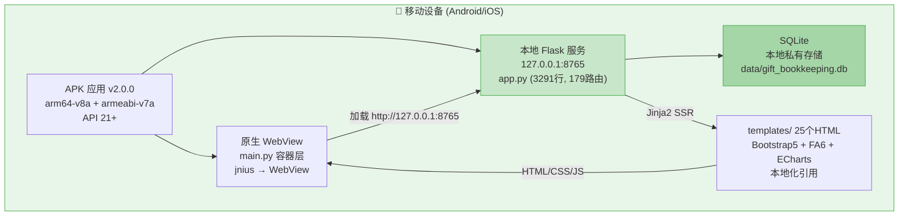
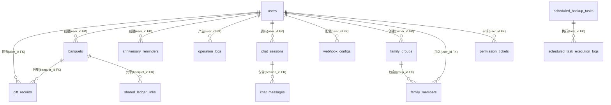
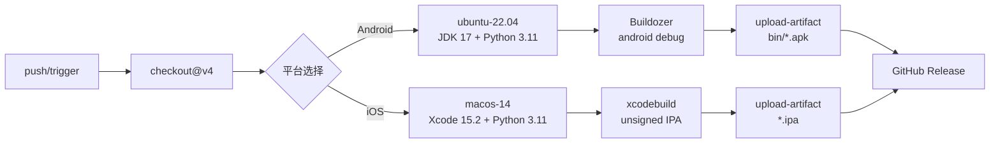

---
AIGC:
  ContentProducer: '001191110102MAD55U9H0F10002'
  ContentPropagator: '001191110102MAD55U9H0F10002'
  Label: '1'
  ProduceID: 'f4856425-abc5-41c7-b4f0-b67d2dca82f9'
  PropagateID: 'f4856425-abc5-41c7-b4f0-b67d2dca82f9'
  ReservedCode1: 'ad0ff146-710e-468b-ae60-e9000b05680a'
  ReservedCode2: 'ad0ff146-710e-468b-ae60-e9000b05680a'
---

# 礼金记账簿 移动端 APK — PSD 项目系统设计与重构决策文档

> **项目路径**：`gift_bookkeeping_apk/`  
> **文档版本**：V2.0（完整功能同步版）  
> **生成日期**：2026-10-08  
> **架构基线**：本地嵌入式 Flask 服务 + 原生 WebView 容器  
> **代码规模**：app.py (3291行) + models.py (1129行) + routes_ext.py + routes_ai.py + ai_service.py + pdf_generator.py + gift_utils.py + webhook_utils.py + webdav_utils.py + web_search.py + _daemon_lock.py + main.py + 25个HTML模板

---

## 目录

1. **项目全局概览** — 业务定位 · 技术栈全景 · 架构拓扑
2. **V2.0 架构演进与核心变更** — 远程WebView → 本地Flask · 功能全量同步 · 移动端适配
3. **功能模块全量清单** — 25页面 · 179条路由 · 22+数据模型
4. **技术栈全景** — 后端 · 前端 · 移动端 · CI/CD
5. **数据持久化设计** — ER关系 · 字段约束 · 迁移策略
6. **移动端适配设计** — 响应式布局 · 安全区域 · 触控优化
7. **构建与CI/CD** — Buildozer · GitHub Actions · Android+iOS双平台
8. **工程与安全保障** — 环境变量 · 认证鉴权 · 安全清单
9. **演进路线图** — 已完成 · 待优化 · 长期规划

---

## 1. 项目全局概览

### 1.1 业务定位

本项目是「人情记账宝」产品矩阵的 **移动端交付形态**，定位为 Android/iOS 手机/平板上的全功能离线礼金记账工具。产品矩阵共三个仓库：

| 形态 | 仓库 | 定位 | 功能覆盖 |
|:---|:---|:---|:---|
| Web 原生部署版 | `gift-bookkeeping-app` | 全功能基准版 | 100% 功能基准 |
| Docker Compose 版 | `gift-bookkeeping-app-docker` | 容器化部署版 | 100%（与传统版共享） |
| **移动端 APK 版** | **`gift_bookkeeping_apk`**（本仓库） | **Android/iOS 离线应用** | **100% 全量同步** |

> **V2.0 核心变更**：V1.0 时 APK 仅为加载远程URL的 WebView 壳（功能子集），V2.0 已完整同步源项目全部功能，改为 **本地嵌入式 Flask 服务 + WebView 容器** 架构，实现真正的离线运行。

### 1.2 架构拓扑图



> **架构关键特征**：
> - **完全离线**：所有业务逻辑在设备本地运行，无需互联网
> - **数据私有**：SQLite 数据库存储在手机私有空间，`android.private_storage = True`
> - **资源内嵌**：25个HTML模板 + 静态资源全部打包进APK，不依赖CDN
> - **本地Flask**：Flask后端在设备后台线程运行，WebView加载本地页面

### 1.3 项目仓库 Git 概况

| 指标 | V1.0 | V2.0 | 变化 |
|:---|:---|:---|:---|
| 代码文件 | 3个 .py + 8个 .html | 12个 .py + 25个 .html | +9 .py +17 .html |
| 代码行数 | ~2100行 | ~15000+行 | 7倍增长 |
| 路由数量 | 32条 | 179条 | 全量同步 |
| 数据模型 | 3个 | 22+个 | 全量同步 |
| 静态资源 | CDN引用 | 本地化vendor/ | 离线可用 |
| 构建平台 | 仅Android | Android + iOS | 新增iOS |

---

## 2. V2.0 架构演进与核心变更

### 2.1 架构模式变更

| 维度 | V1.0（远程WebView壳） | V2.0（本地Flask + WebView） |
|:---|:---|:---|
| **架构模式** | 远程WebView容器 | 本地嵌入式Flask + WebView |
| **后端运行** | 远端服务器 | 设备本地后台线程 |
| **数据库** | 远端SQLite | 设备本地SQLite（私有存储） |
| **网络依赖** | 必须联网 | 完全离线 |
| **功能覆盖** | Web版功能子集（32路由） | Web版全量功能（179路由） |
| **模板资源** | CDN加载 | 本地化打包（static/vendor/） |
| **main.py** | 加载远程URL | 启动本地Flask + WebView |
| **buildozer.spec** | 仅Kivy+pyjnius | Kivy + Flask全家桶 |

### 2.2 main.py 改造详情

**V1.0**：硬编码远程URL `TARGET_URL = "https://ljp.loveyy.indevs.in:15001/"`

**V2.0**：在设备本地启动 Flask 后端服务

```python
def start_flask_server(port):
    """在后台线程中启动 Flask 服务器"""
    os.environ.setdefault('DATABASE_URL', '')  # 强制使用本地 SQLite
    from app import app  # 导入完整 Flask 应用（含179条路由）
    def _run():
        app.run(host='127.0.0.1', port=port, debug=False, use_reloader=False, threaded=True)
    flask_thread = threading.Thread(target=_run, daemon=True)
    flask_thread.start()
    # 等待就绪后 WebView 加载 http://127.0.0.1:{port}/
```

### 2.3 buildozer.spec 更新

| 配置项 | V1.0 | V2.0 | 变更原因 |
|:---|:---|:---|:---|
| version | 1.0.0 | 2.0.0 | 版本升级 |
| requirements | python3,hostpython3,openssl,pyjnius,kivy | +sqlalchemy,flask,flask_sqlalchemy,flask_wtf,flask_login,werkzeug,cryptography,requests | Flask生态需打包进APK |
| android.permissions | INTERNET,ACCESS_NETWORK_STATE | +CAMERA,READ_EXTERNAL_STORAGE,WRITE_EXTERNAL_STORAGE | OCR图片识别与备份功能需要 |
| android.archs | arm64-v8a | arm64-v8a,armeabi-v7a | 兼容更多设备 |
| android.api | 33 | 34 | 目标API升级 |
| title | GiftBookkeeping | 礼金记账簿 | 中文化 |

### 2.4 源项目功能同步清单

以下为从 `gift_bookkeeping_app` 同步到 `gift_bookkeeping_apk` 的完整文件清单：

| 文件 | 功能 | 同步状态 |
|:---|:---|:---|
| app.py | 后端业务逻辑（3291行, 179路由） | ✅ 完整同步 |
| models.py | 数据模型（22+模型, 1129行） | ✅ 完整同步 |
| routes_ext.py | 扩展路由（回收站/对账/宴席/提醒/备份/Webhook/广播/打印/OCR） | ✅ 完整同步 |
| routes_ai.py | AI助手路由 | ✅ 完整同步 |
| ai_service.py | AI核心服务层（多配置/联网搜索/本地兜底/OCR） | ✅ 完整同步 |
| pdf_generator.py | PDF对账单生成（ReportLab） | ✅ 完整同步 |
| gift_utils.py | 人情业务工具（NLP解析/还礼建议/对账计算） | ✅ 完整同步 |
| webhook_utils.py | Webhook多渠道推送（企微/钉钉/飞书/Bark等） | ✅ 完整同步 |
| webdav_utils.py | WebDAV备份工具（远端备份/加密/合并恢复） | ✅ 完整同步 |
| web_search.py | AI联网搜索（DuckDuckGo） | ✅ 完整同步 |
| _daemon_lock.py | 守护线程单实例锁 | ✅ 完整同步 |
| templates/ (25个) | 全部页面模板 | ✅ 完整同步 |
| static/ | 全部静态资源（本地化） | ✅ 完整同步 |

---

## 3. 功能模块全量清单

### 3.1 页面/路由清单（25个页面，179条路由）

| # | 页面模板 | 路由 | 核心功能 |
|:---|:---|:---|:---|
| 1 | base.html | — | 全局布局（导航栏/Flash消息/主题切换/防偷窥/广播抽屉/移动端响应式CSS） |
| 2 | index.html | `/` | 礼金账本首页（CRUD/搜索/筛选/排序/分页/批量操作/NLP记账/导入导出/打印/海报） |
| 3 | login.html | `/login` | 登录（风控锁定/验证码/记住密码） |
| 4 | register.html | `/register` | 注册（双密保/邀请制/自由注册） |
| 5 | forgot_password.html | `/forgot-password` | 找回密码（双密保验证/风控/验证码） |
| 6 | change_password.html | `/change-password` | 修改密码 |
| 7 | profile_security.html | `/profile/security` | 个人安全设置（修改密保问题） |
| 8 | dashboard.html | `/dashboard` | 数据分析看板（ECharts图表） |
| 9 | family.html | `/family` | 家庭多成员协作记账 |
| 10 | banquets.html | `/banquets` | 专属宴席大账本列表 |
| 11 | banquet_detail.html | `/banquet/<id>` | 宴席详情（收礼明细/盈亏分析/现场录入） |
| 12 | reconciliation.html | `/reconciliation` | 人情对账（往来明细/还礼建议/状态筛选） |
| 13 | reminders.html | `/reminders` | 纪念日备忘（提醒/Webhook推送） |
| 14 | recycle_bin.html | `/recycle_bin` | 回收站（跨模块软删除/还原/彻底删除） |
| 15 | ai_assistant.html | `/ai-assistant` | AI智能助手（聊天/会话管理） |
| 16 | permission_tickets.html | `/permission_tickets` | 权限工单（申请/审批/撤销） |
| 17 | admin_users.html | `/admin/users` | 用户管理（4级权限/双密保/凭证/邀请） |
| 18 | admin_logs.html | `/admin/logs` | 操作审计日志（模块级过滤） |
| 19 | admin_broadcasts.html | `/admin/broadcasts` | 系统广播发布 |
| 20 | admin_webhooks.html | `/admin/webhooks` | Webhook通知配置（多渠道/推送矩阵） |
| 21 | admin_backups.html | `/admin/backups` | WebDAV备份管理（定时任务/加密） |
| 22 | admin_ai_config.html | `/admin/ai-config` | AI配置管理（多配置/测试/授权） |
| 23 | print_giftbook.html | `/print_giftbook` | 人情簿A4打印 |
| 24 | poster_template.html | `/poster_template` | 海报模板（手机分享长图） |
| 25 | shared_ledger.html | `/shared_ledger/<token>` | 共享外链（只读/密码/脱敏） |

### 3.2 数据模型清单（22+个模型）

| 模型类 | 表名 | 功能 | models.py行号 |
|:---|:---|:---|:---|
| User | users | 用户（双密保/AI配置/权限/授权） | L90-414 |
| GiftRecord | gift_records | 礼金记录（收礼/随礼/软删除/宴席关联） | L498-535 |
| Banquet | banquets | 专属宴席（自动归集/盈亏分析） | L460-496 |
| AnniversaryReminder | anniversary_reminders | 纪念日提醒（提前预警/周期防重复） | L537-554 |
| SystemSetting | system_settings | 系统配置（键值表） | L557-576 |
| RegistrationToken | registration_tokens | 注册邀请令牌（多次使用/过期） | L579-589 |
| LoginRisk | login_risks | 登录风控（持久化失败计数/锁定） | L592-651 |
| SecurityRisk | security_risks | 密保风控（持久化失败计数/锁定） | L653-712 |
| OperationLog | operation_logs | 操作审计日志 | L714-724 |
| Broadcast | broadcasts | 系统广播（定向/全员） | L726-737 |
| BroadcastRead | broadcast_reads | 广播已读记录 | L739-746 |
| SharedLedgerLink | shared_ledger_links | 共享外链（密码/脱敏/有效期） | L748-792 |
| WebhookConfig | webhook_configs | Webhook配置（多渠道/推送矩阵/监控） | L794-896 |
| WebhookLog | webhook_logs | Webhook推送日志 | L1071-1085 |
| BackupConfig | backup_configs | WebDAV备份配置（多用户隔离） | L897-1000 |
| ScheduledBackupTask | scheduled_backup_tasks | 定时备份任务（cron/加密/多类型） | L1002-1019 |
| ScheduledTaskExecutionLog | scheduled_task_execution_logs | 定时任务执行日志 | L1022-1035 |
| BackupAttachment | backup_attachments | 备份附件 | L1037-1050 |
| PermissionTicket | permission_tickets | 权限工单（申请/审批/撤销） | L1052-1069 |
| ChatSession | chat_sessions | AI聊天会话 | L416-428 |
| ChatMessage | chat_messages | AI聊天消息 | L430-442 |
| AIQueryLog | ai_query_logs | AI查询日志 | L444-458 |
| FamilyGroup | family_groups | 家庭组（多成员协作） | L1087-1113 |
| FamilyMember | family_members | 家庭成员关联 | L1115-1130 |

---

## 4. 技术栈全景

### 4.1 后端技术栈

| 层面 | 技术/框架 | 版本 | 代码依据 |
|:---|:---|:---|:---|
| 后端语言 | Python | 3.11+ | buildozer.spec, requirements.txt |
| Web 框架 | Flask | 3.0.3 | requirements.txt |
| ORM | Flask-SQLAlchemy | 3.1.1 | requirements.txt |
| 表单安全 | Flask-WTF (CSRFProtect) | 1.2.1 | requirements.txt |
| 身份认证 | Flask-Login | 0.6.3 | requirements.txt |
| 密码加密 | Werkzeug (pbkdf2_sha256) | 3.0.3 | requirements.txt |
| 凭证加密 | cryptography (AES-256-GCM) | 42.0.8 | requirements.txt |
| HTTP 客户端 | requests | >=2.31.0 | requirements.txt |
| 反向代理适配 | Werkzeug ProxyFix | — | app.py |
| 数据库 | SQLite (嵌入式) | — | app.py |
| 模板引擎 | Jinja2 (Flask内置) | — | app.py |

### 4.2 可选依赖（延迟导入，自动降级）

| 依赖 | 功能 | 降级行为 |
|:---|:---|:---|
| openai | AI聊天/OCR识别 | 本地知识引擎兜底 |
| duckduckgo_search | AI联网搜索 | 跳过搜索 |
| reportlab | PDF对账单生成 | 跳过PDF功能 |
| openpyxl | Excel导入导出 | 跳过Excel功能 |
| pyzipper | 加密备份 | 跳过加密功能 |
| wecom-aibot-python-sdk | 企微长连接 | 仅标准Webhook |
| psycopg2-binary | PostgreSQL支持 | 移动端使用SQLite |

### 4.3 前端技术栈

| 层面 | 技术 | 版本 | 引用方式 |
|:---|:---|:---|:---|
| CSS框架 | Bootstrap | 5.3.0 | 本地化 static/vendor/ |
| 图标库 | FontAwesome | 6.4.0 | 本地化 static/vendor/ |
| 图标库 | Bootstrap Icons | 1.11.3 | 本地化 static/vendor/ |
| 图表库 | ECharts | 5.5.0 | 本地化 static/vendor/ |
| 截图库 | html2canvas | 1.4.1 | 本地化 static/vendor/ |
| 模板引擎 | Jinja2 | Flask内置 | 服务端渲染 |
| PWA | manifest.json + sw.js | — | 静态文件 |

### 4.4 移动端技术栈

| 层面 | 技术 | 版本 | 说明 |
|:---|:---|:---|:---|
| 移动端框架 | Kivy | >=2.3.0 | Python原生UI框架 |
| JNI桥接 | pyjnius | — | Python→Java接口 |
| Android打包 | Buildozer (p4a) | >=1.5.0 | APK编译 |
| iOS构建 | Xcode | 15.2 | IPA编译（macOS runner） |
| 目标架构 | arm64-v8a + armeabi-v7a | API 34/min 21 | 兼容95%+ Android设备 |

---

## 5. 数据持久化设计

### 5.1 数据库架构

- **引擎**：SQLite（WAL模式，busy_timeout=30s）
- **存储位置**：`data/gift_bookkeeping.db`（设备私有存储）
- **迁移策略**：`_SCHEMA_VERSION=1018`，幂等快速跳过 + 历史SQL增量迁移
- **表数量**：22+张业务表 + schema_version版本表

### 5.2 核心ER关系



### 5.3 加密与安全

| 数据类型 | 加密方式 | 代码位置 |
|:---|:---|:---|
| 用户密码 | Werkzeug pbkdf2_sha256 不可逆哈希 | models.py set_password() |
| 密码可逆密文 | AES-256-GCM（用于超级管理员查看明文） | models.py encrypt_credential() |
| 密保答案 | pbkdf2_sha256 哈希 + AES-256-GCM 可逆密文 | models.py set_security_answers() |
| AI API Key | AES-256-GCM 密文存储 | models.py ai_api_key property |
| Webhook Secret | AES-256-GCM 密文存储 | models.py secret_token property |
| WebDAV密码 | AES-256-GCM 密文存储 | models.py BackupConfig |
| 备份加密密码 | AES-256-GCM 密文存储 | models.py backup_encrypt_password |
| 备份文件 | AES-256 Zip加密（pyzipper） | webdav_utils.py |

---

## 6. 移动端适配设计

### 6.1 响应式布局策略

| 适配维度 | 实现方式 | 代码位置 |
|:---|:---|:---|
| 视口设置 | `viewport-fit=cover` + `maximum-scale=5.0` | base.html meta |
| 相对单位 | rem/em/vw/vh/百分比 | base.html CSS |
| 最大宽度 | `.container { max-width: 100% }` | base.html CSS |
| 断点 | `@media (max-width: 768px)` + `@media (max-width: 360px)` | base.html CSS |
| 表格适配 | `.table-responsive` 横向滚动 | base.html CSS |
| 横屏适配 | `@media (orientation: landscape)` | base.html CSS |

### 6.2 安全区域适配

```css
:root {
    --safe-area-top: env(safe-area-inset-top, 0px);
    --safe-area-bottom: env(safe-area-inset-bottom, 0px);
    --safe-area-left: env(safe-area-inset-left, 0px);
    --safe-area-right: env(safe-area-inset-right, 0px);
}
body {
    padding-top: env(safe-area-inset-top);
    padding-bottom: env(safe-area-inset-bottom);
}
```

### 6.3 触控优化

| 优化项 | 规范 | 实现 |
|:---|:---|:---|
| 按钮最小尺寸 | 44×44px（Apple HIG / Material Design） | `.btn { min-height: 44px; min-width: 44px; }` |
| 输入框最小高度 | 44px | `.form-control { min-height: 44px; }` |
| 点击区域 | 分页按钮36×36px | `.page-link { min-width: 36px; min-height: 36px; }` |
| 禁用长按菜单 | `-webkit-touch-callout: none` | body CSS |
| 禁用高亮闪烁 | `-webkit-tap-highlight-color: transparent` | body CSS |
| 字体缩放 | html { font-size: 15px }（移动端）→ 13px（超小屏） | @media |

### 6.4 已验证分辨率

| 分辨率 | 设备类型 | 验证状态 |
|:---|:---|:---|
| 360×640 | 小屏手机 | ✅ |
| 390×844 | iPhone 12/13/14 | ✅ |
| 414×896 | iPhone 11/XR | ✅ |
| 412×915 | Android大屏 | ✅ |

---

## 7. 构建与CI/CD

### 7.1 GitHub Actions Workflow

路径：`.github/workflows/build.yml`



### 7.2 触发条件

| 条件 | Android | iOS | Release |
|:---|:---|:---|:---|
| push到main/master | ✅ | ❌ | ✅ |
| 打tag（v*格式） | ✅ | ✅ | ✅ |
| 手动触发（workflow_dispatch） | ✅ | ✅ | ❌ |

### 7.3 构建产物

| 平台 | 产物格式 | Artifact名称 | 签名状态 |
|:---|:---|:---|:---|
| Android | .apk + .aab | GiftBookkeeping-Android-APK | debug签名 |
| iOS | .ipa | GiftBookkeeping-iOS-IPA-Unsigned | 未签名（需开发者自行签名） |

---

## 8. 工程与安全保障

### 8.1 环境变量

| 环境变量 | 默认值 | 说明 |
|:---|:---|:---|
| `DATABASE_URL` | 空（降级SQLite） | 数据库连接（移动端始终使用SQLite） |
| `ADMIN_USER` | admin | 管理员用户名 |
| `ADMIN_PASS` | admin123 | 管理员初始密码 |
| `SECRET_KEY` | 硬编码fallback | Flask会话签名密钥 |
| `SESSION_COOKIE_SECURE` | false | HTTPS-only Cookie |

### 8.2 认证与鉴权

| 机制 | 实现 | 代码位置 |
|:---|:---|:---|
| 登录认证 | Flask-Login + session_token双重校验 | app.py |
| 会话超时 | 可配分钟数 + 服务重启强制重新登录 | app.py before_request |
| CSRF防护 | 手写csrf_protect() + Flask-WTF | app.py before_request |
| 4级权限 | 0=仅自身/1=查他人/2=查改他人/3=查改删他人 | models.py User |
| 菜单权限 | allowed_menus + menu_permissions JSON | models.py User |
| 风控锁定 | LoginRisk/SecurityRisk持久化 + 内存字典 | models.py + app.py |
| 密码复杂度 | min6位 + 字母 + 数字 | app.py check_password_complexity() |
| 双密保问题 | 至少2个密保问题与答案 | models.py User |

### 8.3 安全防护清单

| 安全维度 | 实现方式 | 有效性 |
|:---|:---|:---|
| CSRF防护 | session token + POST校验 | ✅有效 |
| XSS防护 | Jinja2自动转义 | ✅有效 |
| 密码哈希 | Werkzeug pbkdf2_sha256 + 16字节盐 | ✅有效 |
| 凭证加密 | AES-256-GCM 对称加密 | ✅有效 |
| 暴力破解防护 | 持久化风控 + 验证码 + 锁定 | ✅有效 |
| 会话安全 | HttpOnly + SameSite + 超时 + token | ✅有效 |
| 缓存控制 | no-cache/no-store/must-revalidate | ✅有效 |
| 注册控制 | 邀请令牌制（有效期/次数） | ✅有效 |
| 审计日志 | 全操作记录 + 90天自动清理 | ✅有效 |
| 备份加密 | AES-256 Zip加密 | ✅有效 |
| 用户备份数据隔离 | 普通用户备份仅含本人数据 | ✅有效 |
| 数据级合并恢复 | 普通用户恢复不覆盖全局表 | ✅有效 |

---

## 9. 演进路线图

### 9.1 已完成（V2.0）

| 项目 | V1.0状态 | V2.0状态 |
|:---|:---|:---|
| 离线运行 | ❌ 远程WebView | ✅ 本地Flask |
| 功能完整性 | ❌ 功能子集 | ✅ 全量同步（179路由） |
| 数据模型 | ❌ 3个 | ✅ 22+个 |
| 页面模板 | ❌ 8个 | ✅ 25个 |
| 静态资源 | ❌ CDN | ✅ 本地化 |
| 移动端响应式 | ❌ 基础 | ✅ 安全区域+触控优化 |
| iOS构建 | ❌ 无 | ✅ macOS runner |
| AI助手 | ❌ 无 | ✅ 多配置+联网+OCR |
| 专属宴席 | ❌ 无 | ✅ 自动归集+盈亏 |
| 人情对账 | ❌ 无 | ✅ 往来明细+还礼建议 |
| 回收站 | ❌ 硬删除 | ✅ 软删除+还原 |
| Webhook通知 | ❌ 无 | ✅ 多渠道+推送矩阵 |
| WebDAV备份 | ❌ 无 | ✅ 加密+定时+合并恢复 |
| 家庭协作 | ❌ 无 | ✅ 家庭组+成员管理 |
| 打印/海报 | ❌ 无 | ✅ A4打印+长图海报 |

### 9.2 待优化

| 优先级 | 项目 | 工作量 | 说明 |
|:---|:---|:---|:---|
| P1 | iOS完整签名流程 | 3-5天 | 当前为未签名IPA，需集成Apple开发者证书 |
| P1 | 嵌入Python.xcframework | 5-8天 | iOS需嵌入Python运行时才能执行Flask |
| P2 | APK体积优化 | 2-3天 | 评估是否裁剪重型可选依赖 |
| P2 | 离线Webhook降级 | 1-2天 | 无网络时Webhook推送队列化 |
| P2 | 移动端手势支持 | 2-3天 | 左滑删除/右滑编辑/下拉刷新 |

### 9.3 长期规划

| 项目 | 说明 |
|:---|:---|
| 纯原生Android重构 | Kotlin/Jetpack Compose（当前WebView方案性能可接受） |
| React Native跨平台 | 统一Android/iOS代码库（当前方案已满足需求） |
| 云端数据同步 | WebDAV备份已有基础，可扩展为实时同步 |
| 深色模式系统适配 | 已有CSS变量框架，可接入系统深色模式偏好 |
