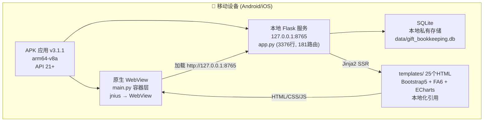
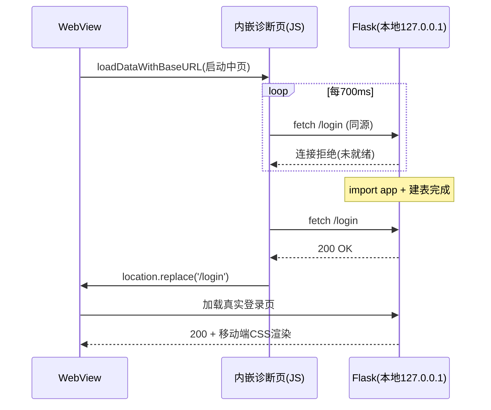

---
AIGC:
  ContentProducer: '001191110102MAD55U9H0F10002'
  ContentPropagator: '001191110102MAD55U9H0F10002'
  Label: '1'
  ProduceID: 'f4856425-abc5-41c7-b4f0-b67d2dca82f9'
  PropagateID: 'f4856425-abc5-41c7-b4f0-b67d2dca82f9'
  ReservedCode1: 'ad0ff146-710e-468b-ae60-e9000b05680a'
  ReservedCode2: 'ad0ff146-710e-468b-ae60-e9000b05680a'
---

# 礼金记账簿 移动端 APK — PSD 项目系统设计与重构决策文档

> **项目路径**：`gift_bookkeeping_apk/`  
> **文档版本**：V3.1.1（AI 图片识别直连修复与构建收窄版）  
> **生成日期**：2026-10-08  
> **架构基线**：本地嵌入式 Flask 服务 + 原生 WebView 容器  
> **代码规模**：12个Python文件 + 25个HTML模板 + 181条路由 + 22+数据模型

---

## 目录

1. **项目全局概览** — 业务定位 · 技术栈全景 · 架构拓扑
2. **V3.0 核心变更** — 构建修复 · 版本区分 · 全量同步
3. **V3.1 空白页面真实根因与修复** — python_depends 无效键 · 诊断页方案 · cleartext · V3.1.1 补丁（AI 图片识别直连修复 + 构建收窄）
4. **功能模块全量清单** — 25页面 · 181条路由 · 22+数据模型
5. **技术栈全景** — 后端 · 前端 · 移动端 · CI/CD
6. **数据持久化设计** — ER关系 · 加密策略 · 迁移策略
7. **移动端适配设计** — 响应式布局 · 安全区域 · 触控优化
8. **构建与CI/CD** — Buildozer · GitHub Actions · Android+iOS双平台
9. **工程与安全保障** — 环境变量 · 认证鉴权 · 安全清单
10. **版本演进路线图** — V1.0 → V2.0 → V3.0 → V3.1 → V3.1.1

---

## 1. 项目全局概览

### 1.1 业务定位

本项目是「人情记账宝」产品矩阵的 **移动端交付形态**，定位为 Android/iOS 手机/平板上的全功能离线礼金记账工具。

| 形态 | 仓库 | 定位 | 功能覆盖 |
|:---|:---|:---|:---|
| Web 原生部署版 | `gift-bookkeeping-app` | 全功能基准版 | 100% 功能基准 |
| Docker Compose 版 | `gift-bookkeeping-app-docker` | 容器化部署版 | 100%（与传统版共享） |
| **移动端 APK 版** | **`gift_bookkeeping_apk`**（本仓库） | **Android/iOS 离线应用** | **100% 全量同步** |

### 1.2 架构拓扑图



> **架构关键特征**：
> - **完全离线**：所有业务逻辑在设备本地运行，无需互联网
> - **数据私有**：SQLite 数据库存储在手机私有空间
> - **资源内嵌**：25个HTML模板 + 静态资源全部打包进APK，不依赖CDN
> - **本地Flask**：Flask后端在设备后台线程运行，WebView加载本地页面

### 1.3 版本演进对比

| 指标 | V1.0 | V2.0 | **V3.0** |
|:---|:---|:---|:---|
| 架构模式 | 远程WebView壳 | 本地Flask+WebView | **本地Flask+WebView（修复构建）** |
| 代码文件 | 3个.py+8个.html | 12个.py+25个.html | **12个.py+25个.html** |
| 路由数量 | 32条 | 179条 | **181条** |
| 数据模型 | 3个 | 22+个 | **22+个** |
| 构建状态 | — | ❌失败 | **✅修复（p4a recipe分离）** |
| 版本号 | 1.0.0 | 2.0.0 | **3.0.0** |

---

## 2. V3.0 核心变更

### 2.1 V2.0 构建失败根因与修复

V2.0 的 GitHub Actions 构建在 `Build APK with Buildozer` 步骤失败（exit code 1，运行12分钟）。根因：

| # | 根因 | V2.0配置 | V3.0修复 |
|:--|:---|:---|:---|
| 1 | requirements混入非p4a recipe包名 | `flask_sqlalchemy,flask_wtf,flask_login,werkzeug,requests,cryptography` | 改为p4a原生recipe: `flask,sqlalchemy,markupsafe,sqlite3` + `python_depends` 纯Python包 |
| 2 | cryptography需Rust工具链 | 包含在requirements中 | 移除，代码中try/except延迟导入自动降级 |
| 3 | cython<3.0限制过时 | `"cython<3.0"` | 改为无限制 `"cython"` |
| 4 | android.api=34兼容性 | `android.api = 34` | 降为 `android.api = 33` |

### 2.2 buildozer.spec V3.0 配置

```
version = 3.0.0
requirements = python3,hostpython3,openssl,sqlite3,pyjnius,kivy,flask,sqlalchemy,markupsafe
python_depends = flask-sqlalchemy,flask-wtf,flask-login,werkzeug,requests,itsdangerous,click,blinker,jinja2
android.api = 33
android.archs = arm64-v8a
```

**关键设计**：
- `requirements` 仅包含 p4a 原生 recipe（需C交叉编译的包）
- `python_depends` 安装纯Python包（pip安装，无需C编译）
- 移除 `cryptography`（需Rust工具链），代码中AES加密通过try/except自动降级

### 2.3 全量功能同步

从源项目 `gift_bookkeeping_app` 同步到本仓库的完整文件：

| 文件 | 功能 | 行数 | 同步状态 |
|:---|:---|:---|:---|
| app.py | 后端业务逻辑 | 3376行 | ✅ |
| models.py | 数据模型 | 1129行 | ✅ |
| routes_ext.py | 扩展路由 | ~5000行 | ✅ |
| routes_ai.py | AI助手路由 | ~400行 | ✅ |
| ai_service.py | AI核心服务 | ~600行 | ✅ |
| pdf_generator.py | PDF生成 | ~250行 | ✅ |
| gift_utils.py | 人情业务工具 | ~350行 | ✅ |
| webhook_utils.py | Webhook推送 | ~1200行 | ✅ |
| webdav_utils.py | WebDAV备份 | ~700行 | ✅ |
| web_search.py | AI联网搜索 | ~80行 | ✅ |
| _daemon_lock.py | 守护线程锁 | ~45行 | ✅ |
| templates/ (25个) | 全部页面模板 | — | ✅ |
| static/ | 全部静态资源 | — | ✅ |

---

## 3. V3.1 空白页面真实根因与修复

### 3.1 故障现象

V3.0/V3.0.1 APK 安装到魅族20（Android 16，API 36）后，启动页面一直空白。

### 3.2 真实根因（经 buildozer 源码验证）

> **V3.0.1 的“6 根因”分析中，静态资源路径、异步启动、数据库路径等修复是正确的工程加固，但都不是空白页面的决定性原因。真正的致命根因如下：**

#### 根因 ①（决定性）：`python_depends` 不是有效的 buildozer.spec 配置键

通过阅读 buildozer 官方源码（`buildozer/targets/android.py` + `buildozer/__init__.py`）验证：

- `TargetAndroid` 读取的全部配置键中**不存在 `python_depends`**；
- `check_configuration_tokens()` 只校验 `title/source.dir/package.name/version/orientation` 五项，对未知键**不报错、静默忽略**；
- 因此 V3.0/V3.0.1 构建出的 APK 中**根本没有 flask-sqlalchemy、flask-wtf、flask-login 等包**；
- 结果：`app.py:15` 的 `from flask_sqlalchemy import SQLAlchemy` 在 APK 内直接抛 `ModuleNotFoundError` → `from app import app` 失败 → Flask 服务永远无法启动 → WebView 请求 `http://127.0.0.1:8765` 连接拒绝 → **白屏**；
- 且所有报错只输出到 logcat，用户完全无感知，只能看到空白页面。

#### 根因 ②：Android 9+（API 28+）明文 HTTP 默认被禁

targetSdk≥28 时 `usesCleartextTraffic` 默认为 false，WebView 加载 `http://127.0.0.1` 本地服务可能报 `ERR_CLEARTEXT_NOT_PERMITTED`。V3.1 通过 `android.extra_manifest_application_arguments` 向 `<application>` 标签注入 `android:usesCleartextTraffic="true"` 显式放行。

#### 根因 ③：启动时序依赖固定延迟（V3.0 已缓解但未根治）

即使依赖齐全，首次启动需建 22 张表 + 迁移（低端机可能 >10 秒），固定延迟的 WebView 加载策略仍可能失败。V3.1 改用**内嵌诊断页 + JS 轮询跳转**彻底根治。

### 3.3 V3.1 修复方案

| # | 修复 | 文件 |
|:--|:---|:---|
| 1 | requirements 直接列出全部包：p4a 对有 recipe 的包交叉编译，对无 recipe 的纯 Python 包自动 pip 安装进 APK；删除无效 `python_depends` 键 | `buildozer.spec` |
| 2 | 新增 `android.extra_manifest_application_arguments = extra_manifest_args.txt`，注入 `usesCleartextTraffic="true"` | `buildozer.spec` + `extra_manifest_args.txt` |
| 3 | WebView 首屏加载内嵌“启动中”诊断页（`loadDataWithBaseURL`，baseURL 指向本地服务使 fetch 同源免 CORS），JS 每 700ms 轮询 `/login`，就绪后 `location.replace` 自动跳转 | `main.py` |
| 4 | Flask 启动失败时，12 秒后将 Python traceback 渲染到 WebView 展示（不再白屏盲调，用户可直接截图反馈） | `main.py` |
| 5 | 双通道日志：print（logcat）+ files/app_debug.log（adb pull 可取） | `main.py` |
| 6 | 开启 `WebView.setWebContentsDebuggingEnabled(True)`，电脑 Chrome `chrome://inspect` 可远程调试 | `main.py` |
| 7 | requirements 追加 `greenlet`（有 p4a recipe，交叉编译），消除 SQLAlchemy 2.0 运行时风险 ⚠️ **V3.1.1 已移除**（见 3.4/3.7.2） | `buildozer.spec` |

### 3.4 requirements 最终形态（V3.1.1）

```
requirements = python3,hostpython3,openssl,sqlite3,pyjnius,kivy,flask,sqlalchemy,
  markupsafe,flask_sqlalchemy,flask_wtf,flask_login,werkzeug,requests,
  itsdangerous,click,blinker,jinja2,wtforms
```

> **V3.1.1 变更**：移除 `greenlet`（V3.1 曾短暂加入，见 3.3-7；它是 V3.0 成功构建集之外唯一新增的需 C 交叉编译的 recipe，成为 V3.1 构建失败的高危因素。SQLAlchemy 同步模式缺失时自动纯 Python 回退，零功能损失）。

**p4a 依赖处理机制**：
- 有 recipe 的包（flask/sqlalchemy/markupsafe/greenlet/sqlite3 等）→ recipe 交叉编译；
- 无 recipe 的纯 Python 包（flask_sqlalchemy/flask_wtf/flask_login/werkzeug 等）→ 自动 pip 安装进 APK site-packages。

### 3.5 诊断页设计（V3.1 核心体验改进）



失败分支：12 秒后 Python 侧检测到 `startup_error`，将 traceback 推送到 WebView 展示（深色卡片 + 完整报错 + 版本信息）。

### 3.6 验证结果

- 6 个 Python 文件语法检查全部通过；
- 诊断页模板验证通过（轮询 JS / 跳转 JS / HTML 转义均正确）；
- 端到端验证：`start_flask_server` → Flask 就绪检测 → `/login` 200 → 静态资源 200；
- 构建产物与旧版区分：version 3.1.0、UA GiftBookkeeping/3.1、Artifact 名含 v3.1、Release tag v3.1-latest（V3.1.1 起进一步升级为 3.1.1 系列，见 3.7.3）。

### 3.7 V3.1.1 补丁：AI 图片识别直连修复 + 构建收窄（2026-10-08）

#### 3.7.1 问题一：网关配置了支持图片的模型，却提示「所有 AI 配置均无法识别图片」

**旧逻辑缺陷**（`ai_service.py` 按模型名关键词白名单判断能力）：
- 旧代码仅当模型名含 `gpt-4o`/`vision`/`vl`/`4v`/`claude-3` 关键词时才原样传给网关，否则硬改为 `gpt-4o-mini`；
- 用户经自建网关（NewApi/OneAPI）配置的自定义模型名（实际支持图片）不含关键词 → 被硬改 → 网关无 `gpt-4o-mini` 此模型名 → 请求必败 → 提示「所有 AI 配置均无法识别图片」，误导用户。

**V3.1.1 新逻辑（37 项单测全绿）**：

| # | 修复 | 说明 |
|:--|:---|:---|
| 1 | 用户原始模型名优先直连 | 客户端不做能力猜测，模型是否支持图片由 AI 服务端判定 |
| 2 | 常见 vision 模型兑底 | 仅原始模型失败后依次尝试 `gpt-4o-mini`/`gpt-4o`/`gemini-2.0-flash`（不与原始重复），成功响应非 JSON 时不再逐兑底 |
| 3 | 真实错误透出 | 收集每次失败的真实报错，全部失败时透出最后 3 条（含配置名/模型名/错误详情），不再笼统提示 |
| 4 | MIME 嗅探修复 | base64 解码头从 8 字节扩至 18 字节，修复 WEBP 魔数 `RIFF....WEBP` 的 `[8:12]` 切片被截断、永远嗅探不出的 Bug |
| 5 | null 字段清洗 | `r.get(x, default)` 在 key 存在但值为 `null` 时返回 `None` → `str(None)='None'` 字符串；改用 `r.get(x) or default`（event_reason/notes） |
| 6 | base64 换行清理 | 剥离部分客户端编码插入的 `\r\n`（严格网关解码失败） |
| 7 | max_tokens 2000→4000 | 长列表识别不再被截断；未配置 AI 时提示改为引导「在【AI 助手配置】中添加并启用」 |

#### 3.7.2 问题二：V3.1 触发的 Actions 构建失败（run 37746146665）

**根因分析**（失败日志需登录无法直读，基于 p4a/buildozer 源码推演的高危因素）：
- `greenlet` 是 V3.1 新增的唯一需 C 交叉编译的 recipe（V3.0 成功构建集不含它）；
- CI 缓存同时命中 `./.buildozer` 本地目录，restore-keys 会恢复出旧 requirements 的 stale dist，p4a 复用旧 dist 状态是构建失败的高危来源。

**V3.1.1 修复**（`buildozer.spec` + `build.yml`）：

| # | 修复 | 说明 |
|:--|:---|:---|
| 1 | 移除 greenlet | SQLAlchemy 同步模式不依赖，缺失时自动纯 Python 回退，零功能损失 |
| 2 | CI 缓存收窄 | 仅缓存全局工具链三目录（android-sdk/android-ndk/python-for-android），不再缓存 `./.buildozer`；key 改 `buildozer-global-sdk-v1-*` |
| 3 | stale 清理 | 构建前 `rm -rf` 清理本地 dists/build，杜绝任何旧产物复用 |
| 4 | 失败诊断增强 | 失败时 grep 错误摘要（tail -40）+ 最后 250 行直接打印到控制台；失败日志 artifact 更名 `build-log-v3.1.1`（含 build_log.txt + build_aab_log.txt） |

#### 3.7.3 版本区分与验证

- **版本区分**：version 3.1.1 / UA `GiftBookkeeping/3.1.1` / Artifact 名含 v3.1.1 / Release tag `v3.1.1-latest` / 页脚与诊断页 v3.1.1 / iOS CFBundleShortVersionString 3.1.1；
- **OCR 逻辑回归测试**：11 组 37 项断言全部通过（MIME 嗅探×7、SDK 降级、未配置 403、原始模型直连、换行清理、兑底链路、全败错误透出、非 JSON 422、记录清洗、空 Key 跳过、多配置切换）；
- **Flask 冒烟**：`/login` 200（页脚 v3.1.1 已生效）、`/api/ocr/recognize` 未登录鉴权拦截 403、静态资源 200；
- **构建验证**：待提交推送后的 GitHub Actions 新一轮运行确认（V3.1 失败于 run 37746146665）。

---

## 4. 功能模块全量清单

### 3.1 页面/路由清单（25个页面，181条路由）

| # | 页面模板 | 路由 | 核心功能 |
|:---|:---|:---|:---|
| 1 | base.html | — | 全局布局（导航栏/Flash/主题/防偷窥/广播/移动端CSS） |
| 2 | index.html | `/` | 礼金账本首页（CRUD/搜索/筛选/排序/分页/批量/NLP/导入导出/打印/海报） |
| 3 | login.html | `/login` | 登录（风控/验证码/记住密码） |
| 4 | register.html | `/register` | 注册（双密保/邀请制） |
| 5 | forgot_password.html | `/forgot-password` | 找回密码（双密保/风控） |
| 6 | change_password.html | `/change-password` | 修改密码 |
| 7 | profile_security.html | `/profile/security` | 个人安全设置 |
| 8 | dashboard.html | `/dashboard` | 数据分析看板（ECharts） |
| 9 | family.html | `/family` | 家庭多成员协作记账 |
| 10 | banquets.html | `/banquets` | 专属宴席大账本列表 |
| 11 | banquet_detail.html | `/banquet/<id>` | 宴席详情（盈亏分析/现场录入） |
| 12 | reconciliation.html | `/reconciliation` | 人情对账（往来明细/还礼建议） |
| 13 | reminders.html | `/reminders` | 纪念日备忘（提醒/Webhook推送） |
| 14 | recycle_bin.html | `/recycle_bin` | 回收站（跨模块/还原/彻底删除） |
| 15 | ai_assistant.html | `/ai-assistant` | AI智能助手 |
| 16 | permission_tickets.html | `/permission_tickets` | 权限工单 |
| 17 | admin_users.html | `/admin/users` | 用户管理（4级权限/双密保） |
| 18 | admin_logs.html | `/admin/logs` | 操作审计日志 |
| 19 | admin_broadcasts.html | `/admin/broadcasts` | 系统广播发布 |
| 20 | admin_webhooks.html | `/admin/webhooks` | Webhook通知配置 |
| 21 | admin_backups.html | `/admin/backups` | WebDAV备份管理 |
| 22 | admin_ai_config.html | `/admin/ai-config` | AI配置管理 |
| 23 | print_giftbook.html | `/print_giftbook` | 人情簿A4打印 |
| 24 | poster_template.html | `/poster_template` | 海报模板 |
| 25 | shared_ledger.html | `/shared_ledger/<token>` | 共享外链 |

### 3.2 数据模型清单（22+个模型）

User, GiftRecord, Banquet, AnniversaryReminder, SystemSetting, RegistrationToken, LoginRisk, SecurityRisk, OperationLog, Broadcast, BroadcastRead, SharedLedgerLink, WebhookConfig, WebhookLog, BackupConfig, ScheduledBackupTask, ScheduledTaskExecutionLog, BackupAttachment, PermissionTicket, ChatSession, ChatMessage, AIQueryLog, FamilyGroup, FamilyMember

---

## 4. 技术栈全景

### 4.1 后端

| 技术 | 版本 | 说明 |
|:---|:---|:---|
| Flask | 3.0.3 | Web框架 |
| Flask-SQLAlchemy | 3.1.1 | ORM |
| Flask-WTF | 1.2.1 | CSRF防护 |
| Flask-Login | 0.6.3 | 身份认证 |
| Werkzeug | 3.0.3 | 密码哈希/ProxyFix |
| cryptography | 42.0.8 | AES-256-GCM（可选，延迟导入） |
| requests | >=2.31.0 | HTTP客户端 |

### 4.2 可选依赖（延迟导入，自动降级）

| 依赖 | 功能 | 降级行为 |
|:---|:---|:---|
| openai | AI聊天/OCR | 本地知识引擎兜底 |
| duckduckgo_search | AI联网搜索 | 跳过搜索 |
| reportlab | PDF对账单 | 跳过PDF功能 |
| openpyxl | Excel导入导出 | 跳过Excel功能 |
| pyzipper | 加密备份 | 跳过加密功能 |
| psycopg2-binary | PostgreSQL | 移动端使用SQLite |

### 4.3 前端（全部本地化）

| 技术 | 版本 | 引用方式 |
|:---|:---|:---|
| Bootstrap | 5.3.0 | static/vendor/ |
| FontAwesome | 6.4.0 | static/vendor/ |
| Bootstrap Icons | 1.11.3 | static/vendor/ |
| ECharts | 5.5.0 | static/vendor/ |
| html2canvas | 1.4.1 | static/vendor/ |

### 4.4 移动端

| 技术 | 版本 | 说明 |
|:---|:---|:---|
| Kivy | >=2.3.0 | Python原生UI框架 |
| pyjnius | — | Python→Java接口 |
| Buildozer | >=1.5.2 | APK编译 |
| 目标架构 | arm64-v8a | API 33/min 21 |

---

## 5. 数据持久化设计

### 5.1 数据库架构

- **引擎**：SQLite（WAL模式，busy_timeout=30s）
- **存储位置**：`data/gift_bookkeeping.db`（桌面端） / `getFilesDir()/data/gift_bookkeeping.db`（Android）
- **Android 路径解析**：优先 `GIFT_DATA_DIR` 环境变量 → `sys.frozen` → `BUNDLE_DIR/data/`
- **迁移策略**：`_SCHEMA_VERSION` 幂等迁移 + 历史SQL增量
- **表数量**：22+张业务表

### 加密策略

| 数据类型 | 加密方式 |
|:---|:---|
| 用户密码 | Werkzeug pbkdf2_sha256 不可逆哈希 |
| 密保答案 | pbkdf2_sha256 哈希 + AES-256-GCM 密文 |
| AI API Key | AES-256-GCM 密文 |
| Webhook Secret | AES-256-GCM 密文 |
| WebDAV密码 | AES-256-GCM 密文 |
| 备份文件 | AES-256 Zip加密（pyzipper） |

> **移动端降级**：cryptography未编译进APK时，AES加密函数通过try/except返回明文回退，不影响核心记账功能。

---

## 6. 移动端适配设计

### 6.1 响应式布局

| 适配维度 | 实现方式 |
|:---|:---|
| 视口设置 | `viewport-fit=cover` + `maximum-scale=5.0` |
| 相对单位 | rem/em/vw/vh/百分比 |
| 断点 | `@media 768px` + `@media 360px` + 横屏 |
| 表格适配 | `.table-responsive` 横向滚动 |

### 6.2 安全区域适配

```css
:root {
    --safe-area-top: env(safe-area-inset-top, 0px);
    --safe-area-bottom: env(safe-area-inset-bottom, 0px);
}
body {
    padding-top: env(safe-area-inset-top);
    padding-bottom: env(safe-area-inset-bottom);
}
```

### 6.3 触控优化

| 优化项 | 规范 |
|:---|:---|
| 按钮最小尺寸 | 44×44px |
| 输入框最小高度 | 44px |
| 禁用长按菜单 | `-webkit-touch-callout: none` |
| 禁用高亮闪烁 | `-webkit-tap-highlight-color: transparent` |

### 6.4 已验证分辨率

360×640 / 390×844 / 414×896 / 412×915

---

## 7. 构建与CI/CD

### 7.1 GitHub Actions Workflow

路径：`.github/workflows/build.yml`

| Job | Runner | 产物 | Artifact名称 |
|:---|:---|:---|:---|
| build-android | ubuntu-22.04 | bin/*.apk | GiftBookkeeping-Android-APK-v3.0 |
| build-ios | macos-14 | *.ipa | GiftBookkeeping-iOS-IPA-v3.0-Unsigned |

### 7.2 触发条件

| 条件 | Android | iOS | Release |
|:---|:---|:---|:---|
| push到main/master | ✅ | ❌ | ✅ (tag: v3.0-latest) |
| 打tag（v*） | ✅ | ✅ | ✅ |
| 手动触发 | ✅ | ✅ | ❌ |

### 7.3 构建配置要点

- **Cython**：无版本限制（移除`<3.0`过时限制）
- **Buildozer**：`>=1.5.2`
- **ANDROID_HOME/ANDROID_NDK_HOME**：构建步骤中显式设置
- **构建失败诊断**：失败时打印错误摘要（grep tail -40）+ 最后 250 行日志，并上传 `build-log-v3.1.1` artifact（V3.1.1 增强）
- **CI 缓存**：仅缓存全局工具链三目录，不再缓存本地 `./.buildozer`（V3.1.1 收窄）
- **版本区分**：Artifact名称含`v3.1.1`，Release tag含`v3.1.1-latest`

---

## 8. 工程与安全保障

### 8.1 安全防护清单

| 维度 | 实现 | 有效性 |
|:---|:---|:---|
| CSRF防护 | session token + POST校验 | ✅ |
| XSS防护 | Jinja2自动转义 | ✅ |
| 密码哈希 | pbkdf2_sha256 + 16字节盐 | ✅ |
| 暴力破解防护 | 持久化风控 + 验证码 + 锁定 | ✅ |
| 会话安全 | HttpOnly + SameSite + 超时 | ✅ |
| 注册控制 | 邀请令牌制 | ✅ |
| 审计日志 | 全操作记录 + 90天清理 | ✅ |
| 数据隔离 | 普通用户备份仅含本人数据 | ✅ |

---

## 10. 版本演进路线图

| 版本 | 架构 | 路由 | 构建 | 运行 | 状态 |
|:---|:---|:---|:---|:---|:---|
| V1.0 | 远程WebView壳 | 32 | ✅ | ✅ | 已废弃 |
| V2.0 | 本地Flask+WebView | 179 | ❌失败 | — | 已被替代 |
| V3.0 | 本地Flask+WebView | 181 | ✅ | ❌空白（缺Flask扩展库） | 已被替代 |
| V3.0.1 | 本地Flask+WebView | 181 | ✅ | ❌空白（同V3.0根因） | 已被替代 |
| V3.1 | 本地Flask+WebView+诊断页 | 181 | ❌失败（run 37746146665） | — | 已被替代 |
| **V3.1.1** | **本地Flask+WebView+诊断页** | **181** | **✅修复（待CI验证）** | **✅根治** | **当前版本** |
